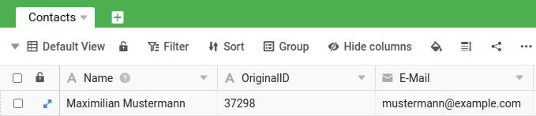

Zapier est le principal fournisseur d'automatisation sans code et s'intègre à plus de 5 000 applications de partenaires tels que Google, Salesforce et Microsoft. Dans cet article, vous apprendrez à concevoir un zap à plusieurs niveaux pour créer une intégration qui automatise la mise à jour des entrées SeaTable existantes. Pour ce faire, une recherche dans Zapier est utilisée pour identifier les entrées souhaitées dans SeaTable afin de les mettre à jour en conséquence.



## Exemple : mise à jour automatique des contacts à partir de Brevo

Imaginez que vous utilisiez Brevo (anciennement SendinBlue) pour gérer vos relations avec vos clients et que, par conséquent, toutes vos données de contact client soient enregistrées dans Brevo. Dans cet exemple, les données de contact doivent être transférées de Brevo vers Sendinblue à l'aide de Zapier. Cela signifie que lorsque de nouveaux contacts sont créés dans Brevo, ils sont également créés dans SeaTable.

Cette exigence peut être réalisée par une recherche intermédiaire dans le Zap, dont vous découvrirez le fonctionnement exact dans cet article d'aide.

### Création de la SeaTable Base pour stocker les contacts

Pour pouvoir envoyer les contacts de Brevo à Seatable, nous avons besoin d'une base appropriée. Pour que l'exemple soit aussi simple que possible, nous créons une base minimale avec seulement trois colonnes.

- Nom
- OriginalID
- Courriel :

Les noms des colonnes n'ont en principe pas d'importance, mais ce qui est important, c'est que nous ayons une colonne dans laquelle est enregistrée une valeur qui identifie clairement l'utilisateur. Chez Brevo, il s'agit de l'ID originale, qui ne change pas. Nous utilisons cette valeur dans le Zap lors de la recherche pour identifier clairement un contact.

### Chaque création ou adaptation de contact déclenche le zap

Brevo propose une application Zapier avec l'événement _New or Updated Contact dans Brevo_. Ce déclencheur est idéal, car il réagit aussi bien aux nouveaux contacts qu'aux modifications. Le graphique suivant montre les valeurs de retour d'un client créé à titre de test.

### La recherche du contact à l'aide de l'ID originale

La deuxième action du zap est maintenant le _Find Row_. Cet événement permet de rechercher une valeur de manière ciblée dans une colonne. Comme nous l'avons déjà annoncé plus haut, nous utilisons l'ID originale pour rechercher le contact. Il y a maintenant deux possibilités : soit aucune entrée n'est trouvée, ce qui signifie qu'il s'agit d'un nouveau contact et qu'il faut le créer, soit l'entrée est trouvée, ce qui signifie qu'il faut le créer.

La deuxième possibilité est qu'une entrée soit trouvée, ce qui signifie qu'il n'est pas nécessaire de créer une nouvelle entrée et que nous obtenons à la place l'_ID de la ligne_ du contact dans SeaTable. Nous pouvons alors utiliser cet ID unique pour mettre à jour le contact existant dans la troisième étape.

### Mise à jour du contact

Si le Zap trouve une entrée à la deuxième étape, le contact déjà existant sera mis à jour à la troisième étape. Une action avec l'événement _Update Row_ est utilisée à cet effet. L'ID de ligne unique de l'étape 2 permet de déterminer quelle entrée doit être mise à jour, sachant que dans cet exemple, seuls le nom et l'adresse e-mail sont mis à jour.

Il est bien sûr possible de copier beaucoup plus d'informations de Brevo vers SeaTable. Cet exemple n'avait pour but que d'illustrer la manière dont on peut atteindre les entrées existantes mises à jour par une étape de recherche.
