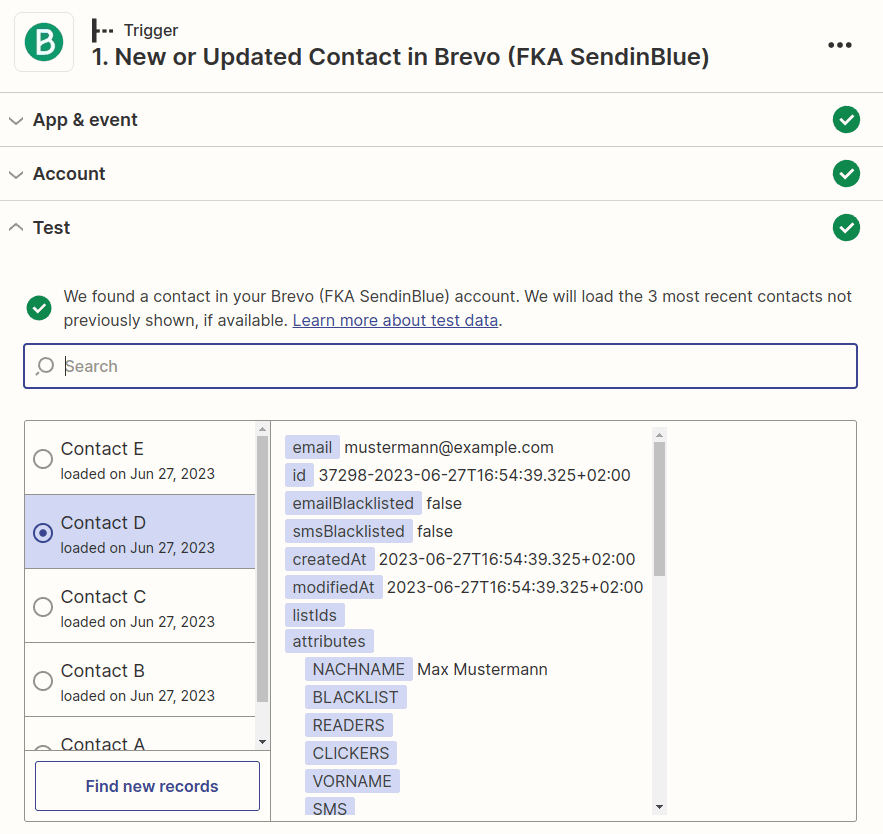

O Zapier é o principal fornecedor de automatização sem código e integra-se com mais de 5000 aplicações de parceiros como a Google, Salesforce e Microsoft. Neste artigo, aprenderá a conceber um Zap de várias etapas para criar uma integração que automatiza a atualização de entradas existentes no SeaTable. Isto é feito através da utilização de uma pesquisa no Zapier para identificar as entradas pretendidas no SeaTable e, em seguida, actualizá-las em conformidade.



## Exemplo: Atualização automática dos contactos do Brevo

Imagine que utiliza o Brevo (anteriormente SendinBlue) para gerir as suas relações com os clientes e, consequentemente, todos os dados de contacto dos seus clientes são armazenados no Brevo. Neste exemplo, os dados de contacto devem agora ser transferidos do Brevo para a Sendinblue usando o Zapier. Isso significa que, quando novos contatos são criados no Brevo, eles também devem ser criados no SeaTable, mas, ao mesmo tempo, quando são feitas alterações nos contatos existentes no Brevo, as entradas correspondentes no SeaTable devem ser atualizadas.

Este requisito pode ser cumprido através de uma pesquisa intermédia no Zap, e ficará a saber como funciona exatamente neste artigo de ajuda.

### Criar a base SeaTable para armazenar os contactos

Para enviar os contactos de Brevo para Seatable, precisamos de uma base adequada. Para manter o exemplo o mais simples possível, criámos uma base mínima com apenas três colunas.

- Nome
- OriginalID
- Correio electrónico

Os nomes das colunas são basicamente irrelevantes, mas é importante que tenhamos uma coluna na qual seja armazenado um valor que identifique exclusivamente o utilizador. No Brevo, este é o ID original, que não é alterado. Utilizamos este valor no Zap durante a pesquisa para identificar um contacto de forma única.

### Cada instalação de contacto ou ajuste de contacto acciona o Zap

O Brevo oferece uma aplicação Zapier com o evento _Contacto novo ou atualizado no Brevo_. Este gatilho é ideal porque reage tanto a novos contactos como a alterações. O gráfico seguinte mostra os valores de retorno de um cliente criado numa base de teste.

### Procurar o contacto utilizando o OriginalID

A segunda ação do Zap é o _Find Row_. Com este evento, pode procurar especificamente um valor numa coluna. Como já foi anunciado acima, utilizamos o ID original para procurar o contacto. Agora existem duas possibilidades: ou não é encontrada qualquer entrada, o que significa que se trata de um novo contacto e que tem de ser criado.

A segunda possibilidade é que seja encontrada uma entrada, o que significa que não é necessário criar uma nova entrada e, em vez disso, obtemos o _ID da linha do_ contacto no SeaTable. Com este ID único, podemos então atualizar o contacto existente no terceiro passo.

### Atualização dos contactos

Se o Zap encontrar uma entrada no segundo passo, o contacto existente é atualizado no terceiro passo. Para tal, é utilizada uma ação com o evento _Update Row (Atualizar linha_ ). O ID de linha único do passo 2 determina que entrada deve ser actualizada, pelo que, neste exemplo, apenas o nome e o endereço de correio eletrónico são actualizados.

É claro que muito mais informações podem ser copiadas do Brevo para o SeaTable. Este exemplo serviu apenas para ilustrar como se pode chegar à atualização de entradas existentes através de um passo de pesquisa.
