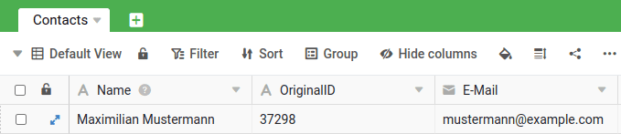
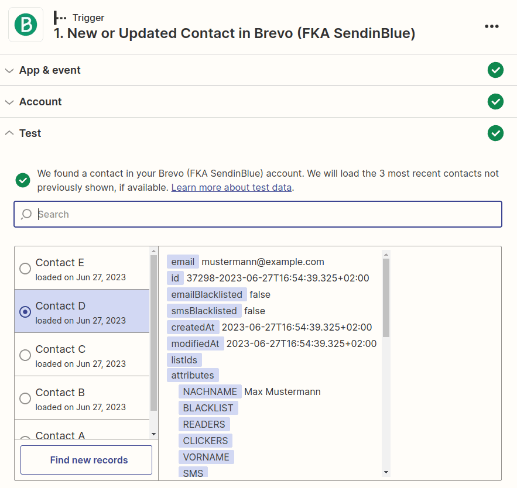
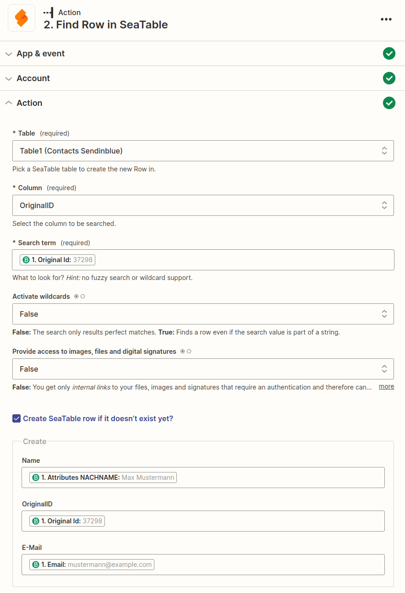
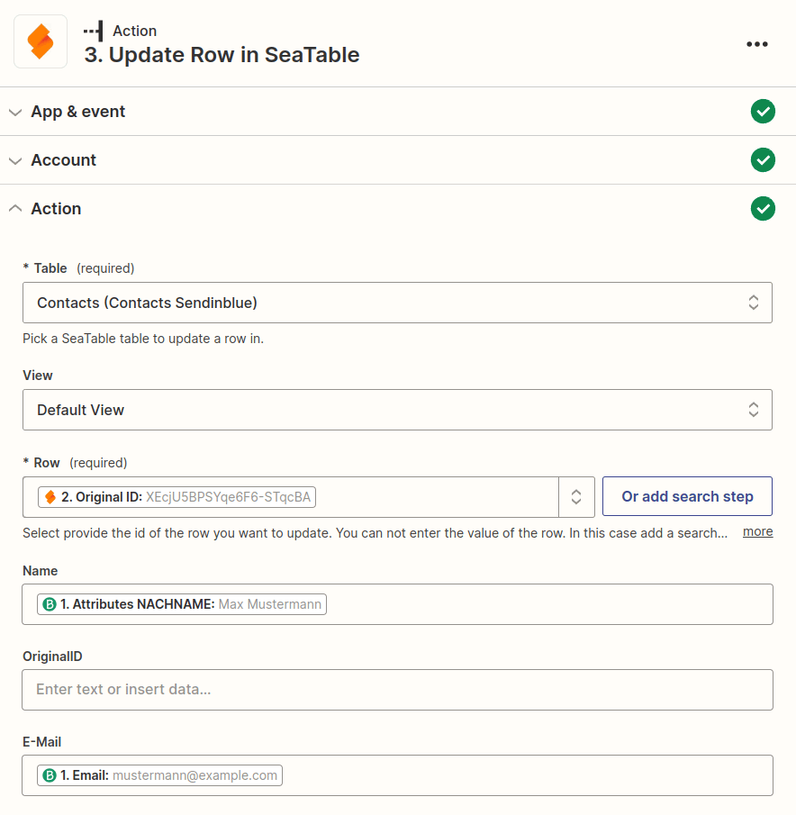

Zapier является ведущим поставщиком автоматизации без кода и интегрируется с более чем 5 000 приложений от таких партнеров, как Google, Salesforce и Microsoft. В этой статье вы узнаете, как разработать многоэтапный Zapier для создания интеграции, которая автоматизирует обновление существующих записей SeaTable. Это делается с помощью поиска в Zapier для определения нужных записей в SeaTable, а затем их соответствующего обновления.



## Пример: Автоматическое обновление контактов из Brevo

Представьте, что вы используете Brevo (ранее SendinBlue) для управления отношениями с клиентами и, соответственно, все контактные данные ваших клиентов хранятся в Brevo. В данном примере контактные данные должны быть переданы из Brevo в Sendinblue с помощью Zapier. Это означает, что при создании новых контактов в Brevo они должны быть созданы и в SeaTable, но в то же время при внесении изменений в существующие контакты в Brevo соответствующие записи в SeaTable должны быть обновлены.

Это требование можно реализовать с помощью промежуточного поиска в Zap, и вы узнаете, как именно это работает, в этой справочной статье.

### Создание базы SeaTable для хранения контактов

Для того чтобы отправить контакты из Brevo в Seatable, нам нужна подходящая база. Чтобы максимально упростить пример, мы создадим минимальную базу с тремя колонками.

- Имя
- OriginalID
- Электронная почта

Названия столбцов в принципе не имеют значения, но важно, чтобы у нас был столбец, в котором хранится значение, однозначно идентифицирующее пользователя. В Brevo это оригинальный ID, который не меняется. Мы используем это значение в Zap во время поиска для уникальной идентификации контакта.

### Каждая установка или регулировка контактов приводит к срабатыванию Zap

Brevo предлагает приложение Zapier с событием _New or Updated Contact в Brevo_. Этот триггер идеально подходит, поскольку он реагирует как на новые контакты, так и на изменения. На следующем графике показаны значения возврата для клиента, созданного на тестовой основе.

### Поиск контакта с использованием исходного идентификатора

Вторым действием Zap является _Find Row_. С помощью этого действия вы можете искать конкретное значение в столбце. Как уже было сказано выше, для поиска контакта мы используем исходный ID. Теперь есть две возможности: либо запись не найдена, что означает, что это новый контакт и его нужно создать.

Вторая возможность заключается в том, что запись найдена, что означает, что не нужно создавать новую запись, а вместо этого мы получаем _ID строки_ контакта в SeaTable. С помощью этого уникального ID мы можем обновить существующий контакт на третьем этапе.

### Обновление контактов

Если на втором этапе Zap находит запись, то на третьем этапе существующий контакт обновляется. Для этого используется действие с событием _Update Row_. Уникальный идентификатор строки из шага 2 определяет, какая запись должна быть обновлена, поэтому в данном примере обновляются только имя и адрес электронной почты.

Конечно, гораздо больше информации может быть скопировано из Brevo в SeaTable. Этот пример лишь иллюстрирует, как можно достичь обновления существующих записей через шаг поиска.
