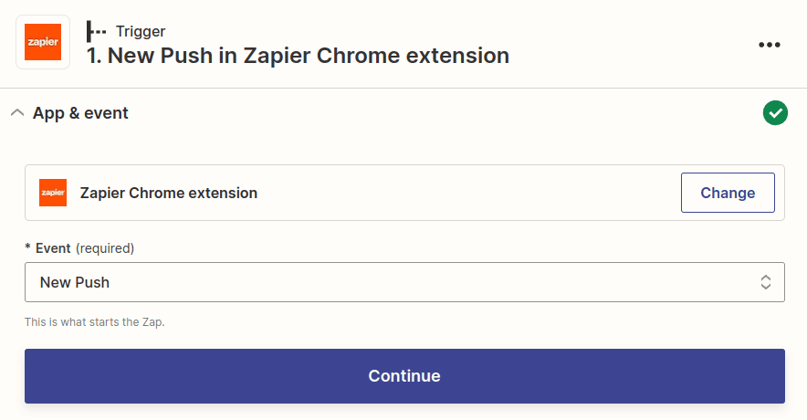

Zapier is an automation platform that lets you connect SeaTable to many other apps and services. In just a few minutes and without any programming knowledge, you can use Zapier to create interfaces with services like Dropbox, Shopify, MailChimp, Calendly, Jotform, Hubspot, and more. These interfaces created by Zapier are called, **Zap**, where each Zap has an app as a _trigger_ and an app as an _action_. The _trigger_ provides the information, which is then processed in one or more _actions_.

In this article, you will learn how to create sophisticated zaps with SeaTable that can both update and create new SeaTable records.

## Zapier basics

The basic structure of a Zap is that there is always a trigger app and one or more action apps. Whenever a certain event occurs in the trigger app, an action is automatically triggered in the action app.

Some examples of zaps could be:

- Every time a new row is created in SeaTable (Trigger), a corresponding appointment is created in Google Calendar (Action).
- Whenever a new subscriber is added in MailChimp (Trigger), a new row is created for that subscriber in SeaTable (Action).
- Whenever you get a new follower on Instagram (Trigger), a new row is created for that follower in SeaTable (Action).

To create a Zap with SeaTable, you need to [sign up for Zapier](https://zapier.com/app/login) (or [create](https://zapier.com/sign-up) a [free account](https://zapier.com/sign-up)). Then you can start creating your first Zap.

## Example 1: Creating a Zap with SeaTable as a trigger to send a Slack message

In this example, we'll use the [CRM & Sales]() template. Using Zapier, we want a message to be posted to our Slack channel for each new entry in the _Opportunity_ table.

### Step 1: Creation of the trigger (SeaTable)

Log in to your [Zapier account](https://zapier.com/app/login) and create a new Zap. Select SeaTable as the app and choose the **New or Updated Row** event type.

The next step is to connect your SeaTable account to Zapier (or select an already connected SeaTable account). If you don't have an API token yet, you need to [generate]() an [API key]() that you enter into Zapier.

After selecting the appropriate account, you will be prompted to configure the trigger-specific setup options. With SeaTable as the trigger, we need to specify the table and the view by clicking on the drop-down menu and selecting the appropriate options (in this case, we want the "Opportunities" table and the "All opportunities" view).

In the next step, Zapier will prompt you to test your trigger. If everything works, you will be shown some of your rows from SeaTable and you can proceed with setting up your Zap.

In the following graphic you can see the preview of three rows from your table. Don't be confused by the way the results are displayed. Instead of your actual column names, the technical identifiers of the columns appear here, such as **column:589r**. This is quite normal and when configuring the following action you will be presented with the correct column names again.

### Step 2: Create the action (Slack)

In the second step, you will be asked to select an action app. Search for _Slack_ and select the Slack app. For Event, select _Send Channel Message_ so that everyone is notified about the new entry in SeaTable.

The next step is to connect your Slack account to Zapier (or select an already connected Slack account).

After that you need to set up the template for the message. There are several customization options here, but at least you need to set a destination channel and message.

When creating the Slack message, you can include both plain text and dynamic data from the incoming SeaTable dataset. For this, you will be shown the data generated by your trigger as an example. A dropdown menu helps you to enter the appropriate values from your trigger. Of course, during the next run these dynamic values will be replaced by new values.

When you're done creating the Slack message, move on to the next step. Zapier creates a summary for you so you can check that everything looks good. Make sure you test the action before you continue.

### Step 3: Publish the Zap

If Zapier was able to successfully deliver the Slack message, all you need to do is activate your Zap so that you will also be notified in Slack for all future SeaTable entries.

Congratulations. You have just created your first own Zap.

## Example 2: Creating a Zap with SeaTable as an action to save bookmarks

The following example shows how you can easily save the currently opened web page as a bookmark in SeaTable using the [Zapier Chrome Extension](https://zapier.com/apps/zapier-chrome-extension/integrations). To be able to save the entries via Zap, you first have to create a base. To keep the example simple, this base has only two text columns.

Next, we create a new Zap, and select _Zapier Chrome Extension_ as the Trigger and the _New Push_ event.

Configuring the _action_ is not difficult either. Create an [API token]() for the base you just created and configure the title and URL to be stored in the appropriate columns of SeaTable. Finally, test the Zap and publish it.

Now install the Zapier Chrome Extension and with two clicks you can save the current web page to your personal favorites list.

Congratulations. You have created a Zap with SeaTable as _Action_.

---

