Zapier es una plataforma de automatización que te permite conectar SeaTable a muchas otras apps y servicios. En pocos minutos y sin conocimientos de programación, puedes utilizar Zapier para crear interfaces con servicios como Dropbox, Shopify, MailChimp, Calendly, Jotform, Hubspot y muchos más. Estas interfaces creadas por Zapier se llaman, **Zap**, donde cada Zap tiene una app como _disparador_ y una app como _acción_. El _disparador_ proporciona la información, que luego se procesa en una o más _acciones_.

En este artículo aprenderá a crear sofisticados zaps con SeaTable que pueden tanto actualizar como crear nuevos conjuntos de datos SeaTable.

## Conceptos básicos de Zapier

La estructura básica de un Zap es que siempre hay una aplicación de activación y una o más aplicaciones de acción. Cada vez que se produce un determinado evento en la aplicación de activación, se activa automáticamente una acción en la aplicación de acción.

Algunos ejemplos de Zaps podrían ser:

- Cada vez que se crea una nueva fila en SeaTable (Activador), se crea una cita correspondiente en Google Calendar (Acción).
- Cada vez que se añade un nuevo suscriptor en MailChimp (activador), se crea una nueva fila para este suscriptor en SeaTable (acción).
- Cada vez que se consigue un nuevo seguidor en Instagram (trigger), se crea una nueva fila para este seguidor en SeaTable (acción).

Para crear un Zap con SeaTable, debe [registrarse en Zapier](https://zapier.com/app/login) (o [crear](https://zapier.com/sign-up) una [cuenta gratuita](https://zapier.com/sign-up)). A continuación, puede empezar a crear su primer Zap.

## Ejemplo 1: Creación de un Zap con SeaTable como disparador para enviar un mensaje Slack

En este ejemplo utilizamos la plantilla [CRM & Sales](https://seatable.io/es/vorlage/pwl4sfutr06dstr9amtlag/). Usando Zapier, queremos que se publique un mensaje en nuestro canal de Slack por cada nueva entrada en la tabla _Oportunidad_.

### Paso 1: Creación del disparador (SeaTable)

Inicie sesión en su [cuenta Zapier](https://zapier.com/app/login) y cree un nuevo Zap. Seleccione SeaTable como aplicación y seleccione el tipo de evento **Fila nueva o actualizada**.

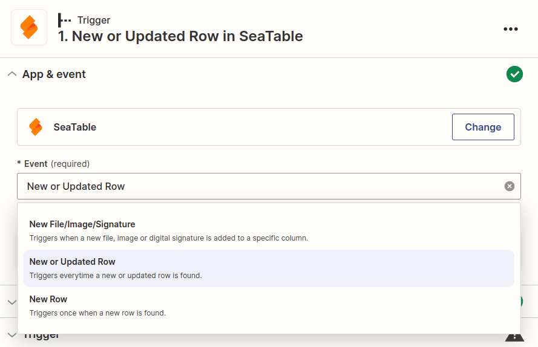

El siguiente paso es conectar su cuenta SeaTable a Zapier (o seleccionar una cuenta SeaTable ya conectada). Si aún no tiene un token de API, tendrá que [generar](https://seatable.io/es/docs/integrationen/zapier-api-tokens-sign-in/) una [clave de API para](https://seatable.io/es/docs/integrationen/zapier-api-tokens-sign-in/) introducirla en Zapier.

Tras seleccionar la cuenta adecuada, se le pedirá que configure las opciones de configuración específicas del disparador. Con SeaTable como disparador, tenemos que especificar la tabla y la vista haciendo clic en el menú desplegable y seleccionando las opciones adecuadas (en este caso queremos la tabla "Oportunidades" y la vista "Todas las oportunidades").

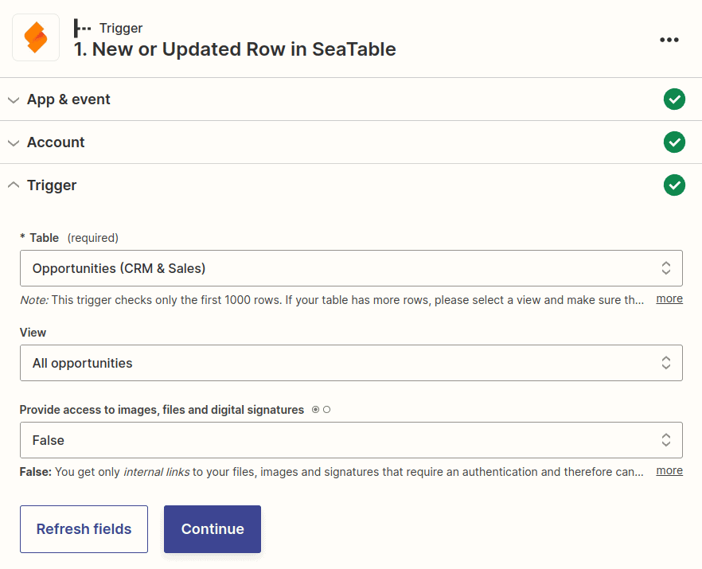

En el siguiente paso, Zapier le pedirá que pruebe su activador. Si todo funciona, se te mostrarán algunas de tus filas de SeaTable y podrás continuar configurando tu Zap.

En el siguiente gráfico puede ver la vista previa de tres filas de su tabla. No se confunda al ver los resultados. En lugar de los nombres reales de las columnas, aparecen los identificadores técnicos de las columnas, como **column:589r**. Esto es bastante normal y cuando configure la siguiente acción, se le presentarán de nuevo los nombres correctos de las columnas.

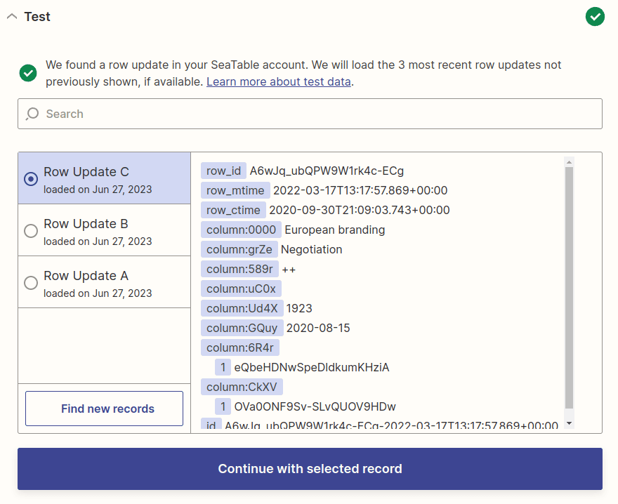

### Paso 2: Crear la acción (Slack)

En el segundo paso, se te pedirá que selecciones una Action App. Busque _Slack_ y seleccione la aplicación Slack. Para Evento, seleccione _Enviar mensaje de canal_ para que todos estén informados sobre la nueva entrada en SeaTable.

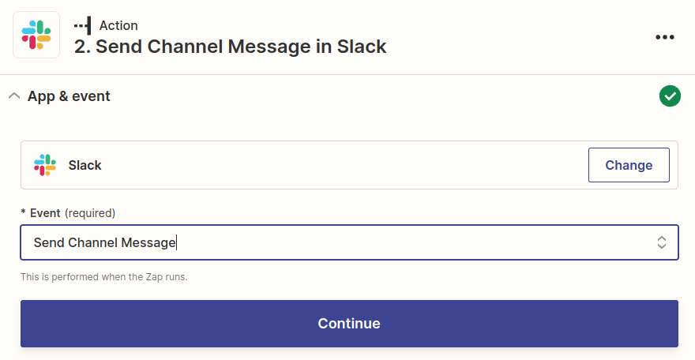

El siguiente paso es conectar tu cuenta de Slack a Zapier (o seleccionar una cuenta de Slack ya conectada).

A continuación, debe configurar la plantilla del mensaje. Aquí hay varias opciones de personalización, pero al menos tienes que establecer un canal de destino y un mensaje.

Al crear el mensaje Slack, puede incluir tanto texto sin formato como datos dinámicos del conjunto de datos SeaTable entrante. Para ello, se le muestran como ejemplo los datos generados por su activador. Un menú desplegable le ayudará a introducir los valores apropiados de su activador. Por supuesto, estos valores dinámicos serán sustituidos por nuevos valores durante la siguiente ejecución.

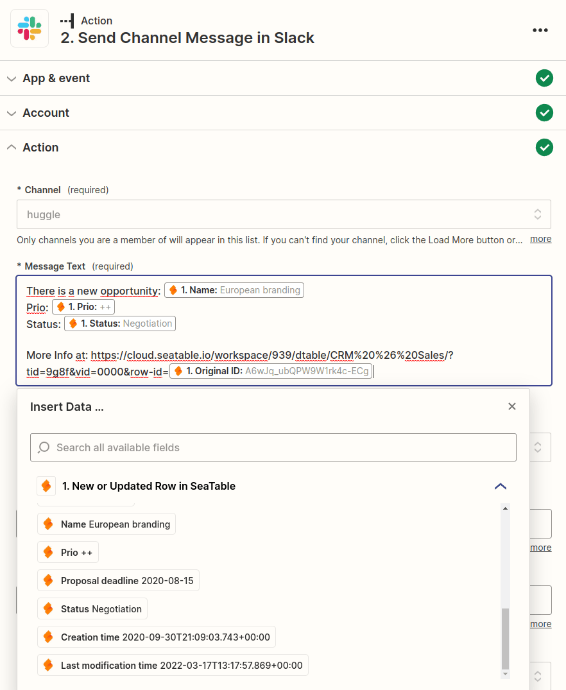

Cuando hayas terminado de crear el mensaje de Slack, pasa al siguiente paso. Zapier creará un resumen para ti para que puedas comprobar que todo se ve bien. Asegúrate de probar la acción antes de continuar.

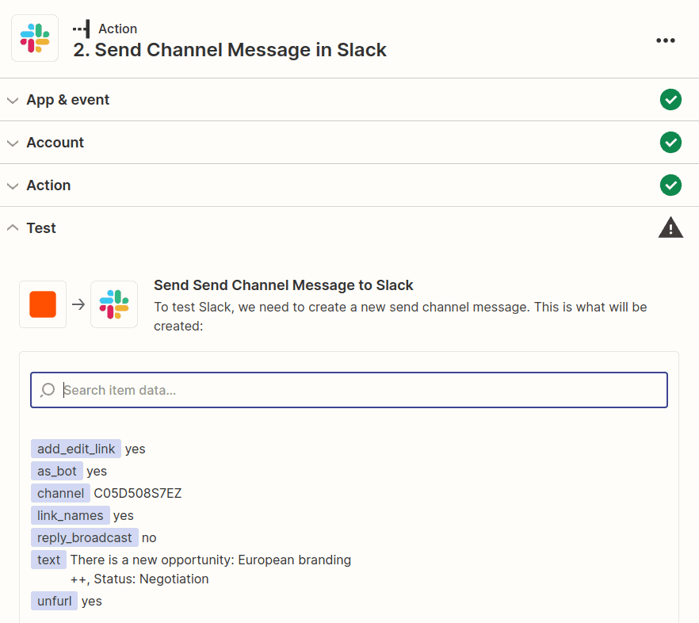

### Paso 3: Publicar el Zap

Si Zapier fue capaz de entregar con éxito el mensaje de Slack, todo lo que necesita hacer es activar su Zap para que también se le notifique en Slack para todas las futuras entradas de SeaTable.

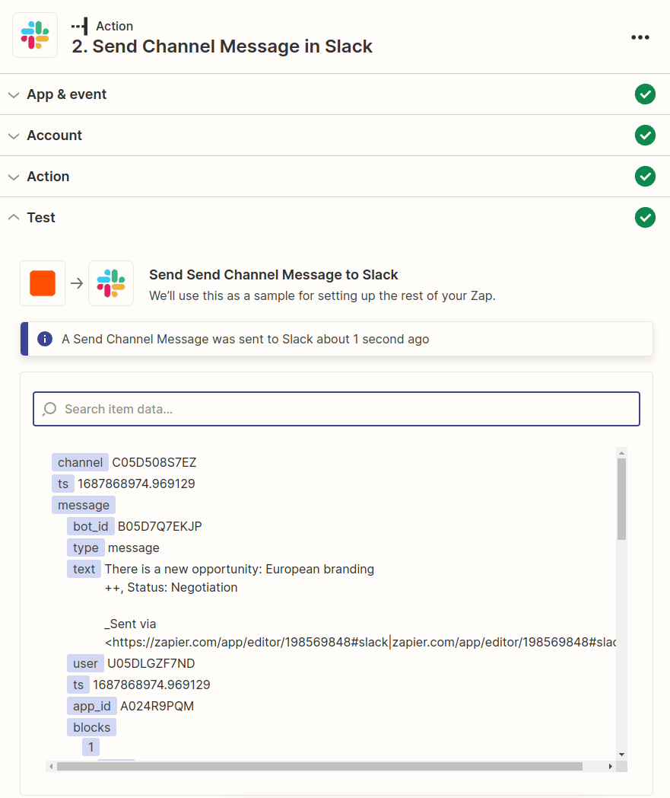

Enhorabuena. Acabas de crear tu primer Zap.

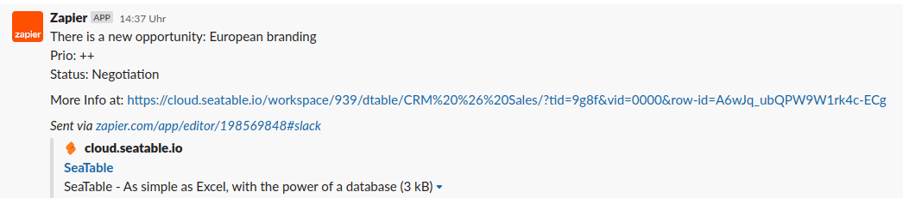

## Ejemplo 2: Creación de un Zap con SeaTable como acción para guardar marcadores

El siguiente ejemplo muestra cómo puede guardar fácilmente el sitio web abierto en ese momento como marcador en SeaTable mediante la [extensión de Chrome Zapier](https://zapier.com/apps/zapier-chrome-extension/integrations). Para poder guardar las entradas a través de Zap, primero tiene que crear una base. Para mantener el ejemplo simple, esta base solo tiene dos columnas de texto.

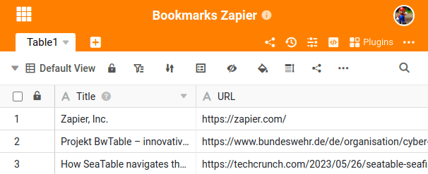

A continuación, creamos un nuevo Zap y seleccionamos _Zapier Chrome Extension_ como disparador y el evento _New Push_.

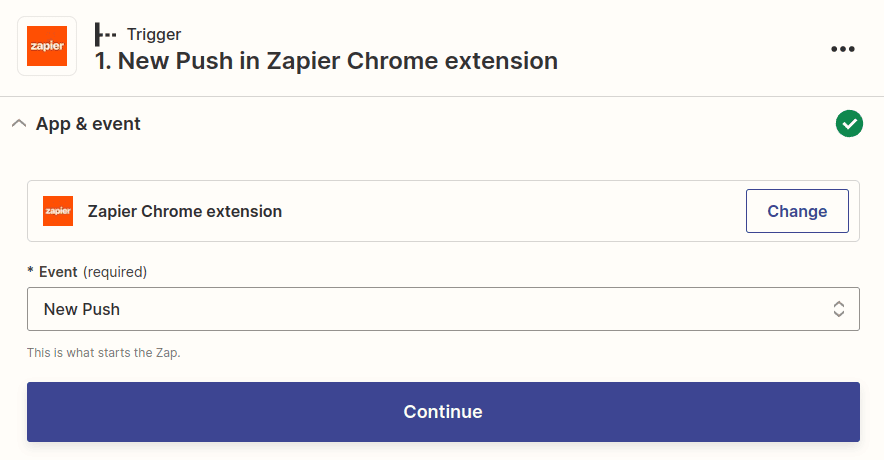

Configurar la _acción_ tampoco es difícil. Cree un [token de API](https://seatable.io/es/docs/zapier-integration/zapier-api-tokens-sign-in/) para la base que acaba de crear y configure el título y la URL para que se almacenen en las columnas correspondientes de SeaTable. Por último, prueba el Zap y publícalo.

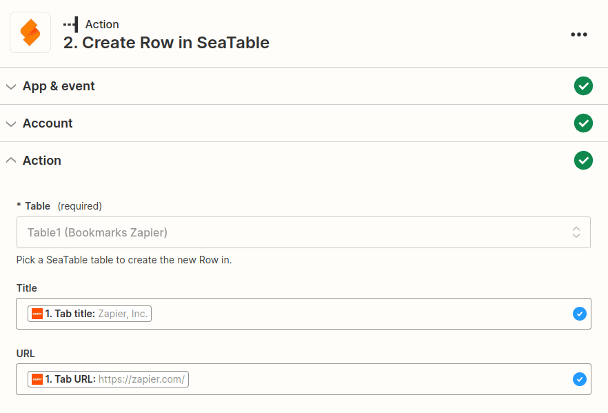

Ahora puedes instalar la extensión de Zapier para Chrome y guardar el sitio web actual en tu lista personal de favoritos con solo dos clics.

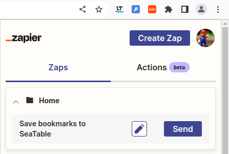

Enhorabuena. Ha creado un Zap con SeaTable como _Acción_.

---

