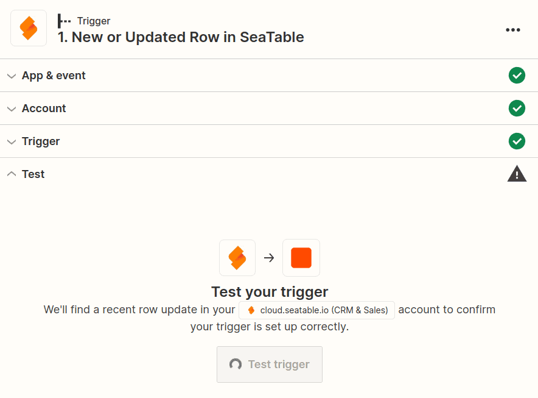
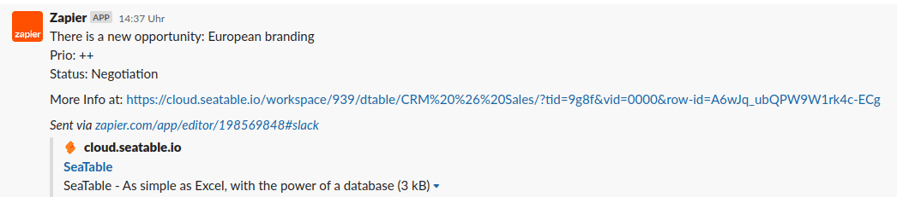

Zapier est une plateforme d'automatisation qui vous permet de connecter SeaTable à de nombreuses autres applications et services. En quelques minutes seulement et sans connaissances en programmation, Zapier vous permet de créer des interfaces avec des services tels que Dropbox, Shopify, MailChimp, Calendly, Jotform, Hubspot et bien d'autres. Ces interfaces créées par Zapier sont appelées **Zap**, chaque Zap ayant une application comme _déclencheur_ et une application comme _action_. Le _déclencheur_ fournit les informations qui sont ensuite traitées dans une ou plusieurs _actions_.

Dans cet article, vous allez apprendre à créer des zaps sophistiqués avec SeaTable, qui peuvent à la fois mettre à jour et créer de nouveaux enregistrements SeaTable.

## Les bases de Zapier

La structure de base d'un Zap est qu'il y a toujours une app de déclenchement et une ou plusieurs apps d'action. Chaque fois qu'un certain événement se produit dans l'application de déclenchement, une action est automatiquement déclenchée dans l'application d'action.

Voici quelques exemples de zaps :

- Chaque fois qu'une nouvelle ligne est créée dans SeaTable (déclencheur), un événement correspondant est créé dans Google Calendar (action).
- Chaque fois qu'un nouvel abonné est ajouté dans MailChimp (trigger), une nouvelle ligne est créée pour cet abonné dans SeaTable (action).
- Chaque fois que vous obtenez un nouveau follower sur Instagram (déclencheur), une nouvelle ligne est créée pour ce follower dans SeaTable (action).

Pour créer un Zap avec SeaTable, vous devez [vous connecter](https://zapier.com/app/login) à [Zapier](https://zapier.com/app/login) (ou [créer](https://zapier.com/sign-up) un [compte gratuit](https://zapier.com/sign-up)). Vous pouvez ensuite commencer à créer votre premier zap.

## Exemple 1 : Créer un zap avec SeaTable comme déclencheur pour envoyer un message Slack

Dans cet exemple, nous utilisons le modèle [CRM & Ventes](). Avec l'aide de Zapier, nous voulons qu'à chaque nouvelle entrée dans le tableau _Opportunité_, un message soit posté sur notre canal Slack.

### Étape 1 : Création du déclencheur (SeaTable)

Connectez-vous à votre [compte Zapier](https://zapier.com/app/login) et créez un nouveau Zap. Sélectionnez SeaTable comme application et choisissez le type d'événement **New or Updated Row**.

L'étape suivante consiste à connecter votre compte SeaTable à Zapier (ou à sélectionner un compte SeaTable déjà connecté). Si vous n'avez pas encore de jeton API, vous devez [générer](https://seatable.io/fr/docs/integrations/zapier-api-tokens-sign-in/) une [clé API](https://seatable.io/fr/docs/integrations/zapier-api-tokens-sign-in/) que vous saisissez dans Zapier.

Après avoir sélectionné le compte approprié, il vous sera demandé de configurer les options de configuration spécifiques au déclencheur. Avec SeaTable comme déclencheur, nous devons spécifier le tableau et la vue en cliquant sur le menu déroulant et en sélectionnant les options correspondantes (dans ce cas, nous voulons le tableau "Opportunities" et la vue "All opportunities").

Dans l'étape suivante, Zapier vous demandera de tester votre déclencheur. Si tout fonctionne, certaines de vos lignes de SeaTable s'affichent et vous pouvez continuer à configurer votre Zap.

Dans le graphique suivant, vous voyez l'aperçu de trois lignes de votre tableau. Ne vous laissez pas troubler par l'affichage des résultats. Au lieu des noms réels des colonnes, ce sont les identificateurs techniques des colonnes qui apparaissent, comme par exemple **column:589r**. C'est tout à fait normal et lors de la configuration de l'action suivante, les noms corrects des colonnes vous seront à nouveau présentés.

### Étape 2 : Création de l'action (Slack)

Dans la deuxième étape, vous êtes invité à choisir une application d'action. Recherchez _Slack_ et sélectionnez l'application Slack. Comme événement, choisissez _Send Channel Message_ pour que tout le monde soit informé de la nouvelle entrée dans SeaTable.

L'étape suivante consiste à connecter votre compte Slack à Zapier (ou à sélectionner un compte Slack déjà connecté).

Ensuite, vous devez configurer le modèle de message. Il existe ici plusieurs options de personnalisation, mais vous devez au moins définir un canal de destination et un message.

Lors de la création du message Slack, vous pouvez inclure du texte simple ainsi que des données dynamiques provenant de l'ensemble des données entrantes de SeaTable. Pour cela, les données générées par votre déclencheur sont affichées à titre d'exemple. Un menu déroulant vous aide à saisir les valeurs appropriées de votre déclencheur. Bien entendu, ces valeurs dynamiques seront remplacées par de nouvelles valeurs lors de la prochaine exécution.

Lorsque vous avez terminé de créer le message Slack, passez à l'étape suivante. Zapier crée un récapitulatif pour vous, afin que vous puissiez vérifier que tout semble bien fonctionner. Assurez-vous de tester l'action avant de continuer.

### Étape 3 : Publier le zap

Si Zapier a réussi à délivrer le message Slack, il ne vous reste plus qu'à activer votre Zap pour être informé dans Slack de toutes les futures entrées de SeaTable.

Toutes nos félicitations ! Vous venez de créer votre premier zap personnel.

## Exemple 2 : Créer une zap avec SeaTable comme action pour enregistrer des signets

L'exemple suivant montre comment l'[extension Zapier Chrome](https://zapier.com/apps/zapier-chrome-extension/integrations) permet d'enregistrer facilement la page web actuellement ouverte comme signet dans SeaTable. Pour pouvoir enregistrer les entrées par Zap, il faut d'abord créer une base. Pour que l'exemple reste simple, cette base ne comporte que deux colonnes de texte.

Ensuite, nous créons un nouveau zap et choisissons _Zapier Chrome Extension_ comme déclencheur et l'événement _New Push_.

La configuration de l'_action_ n'est pas non plus difficile. Créez un [jeton API](https://seatable.io/fr/docs/zapier-integration/zapier-api-tokens-sign-in/) pour la base que vous venez de créer et configurez le titre et l'URL pour qu'ils soient enregistrés dans les colonnes appropriées de SeaTable. Pour finir, testez le zap et publiez-le.

Installez maintenant l'extension Zapier Chrome et enregistrez dès maintenant en deux clics la page web actuelle dans votre liste de favoris personnelle.

Nous vous félicitons. Vous avez créé une Zap avec SeaTable comme _action_.

---

