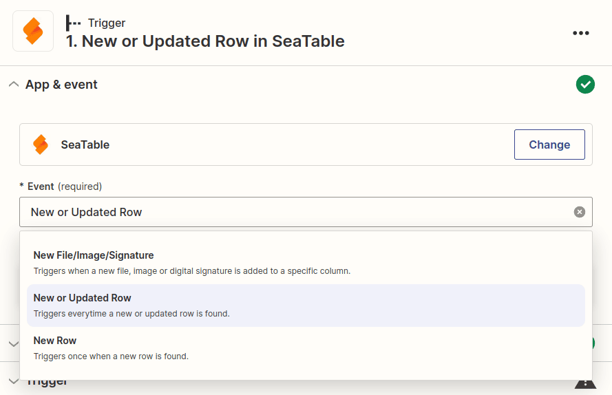
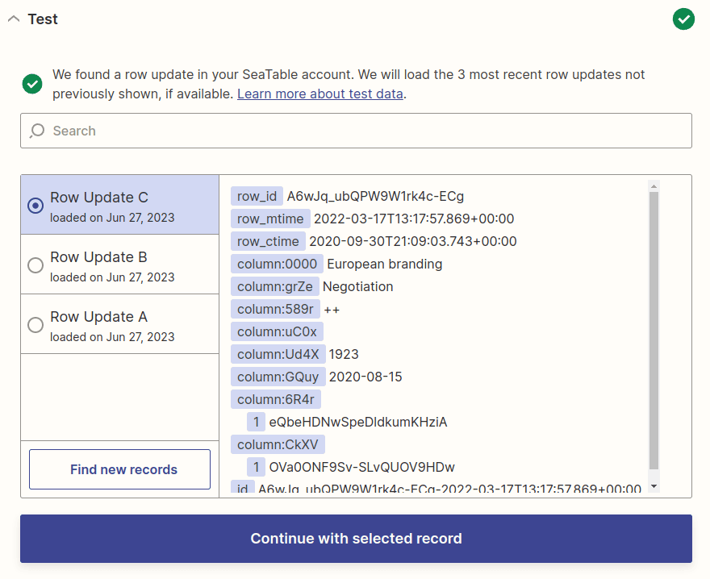
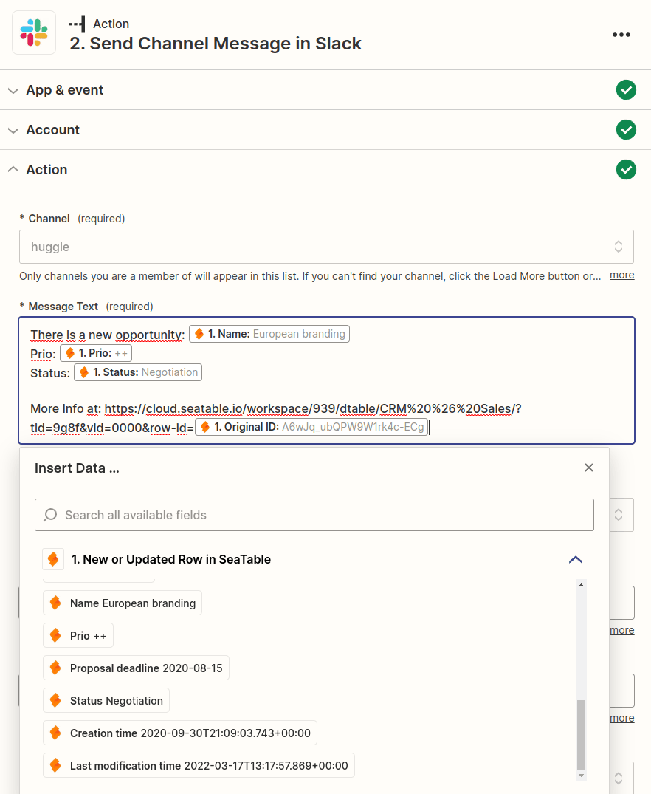
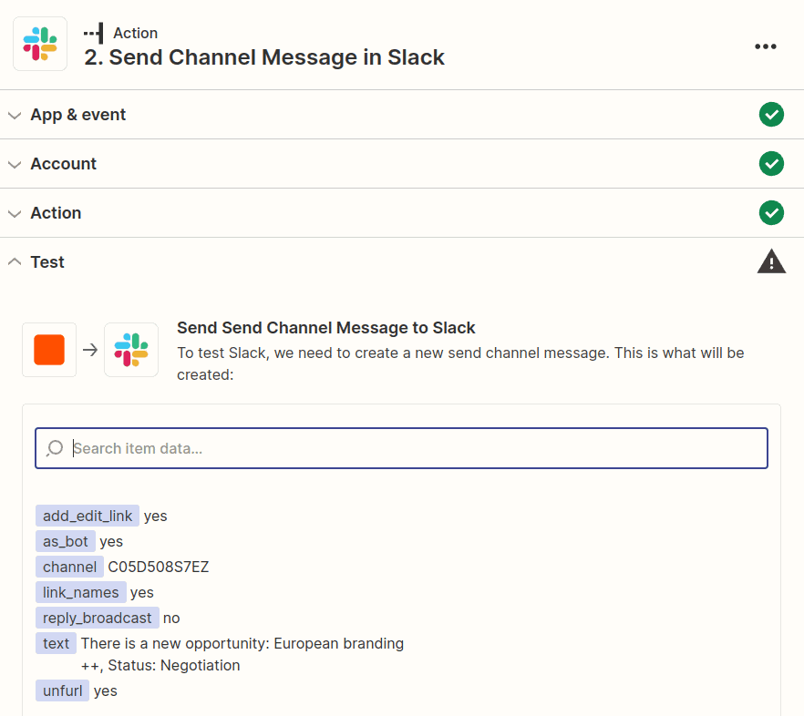
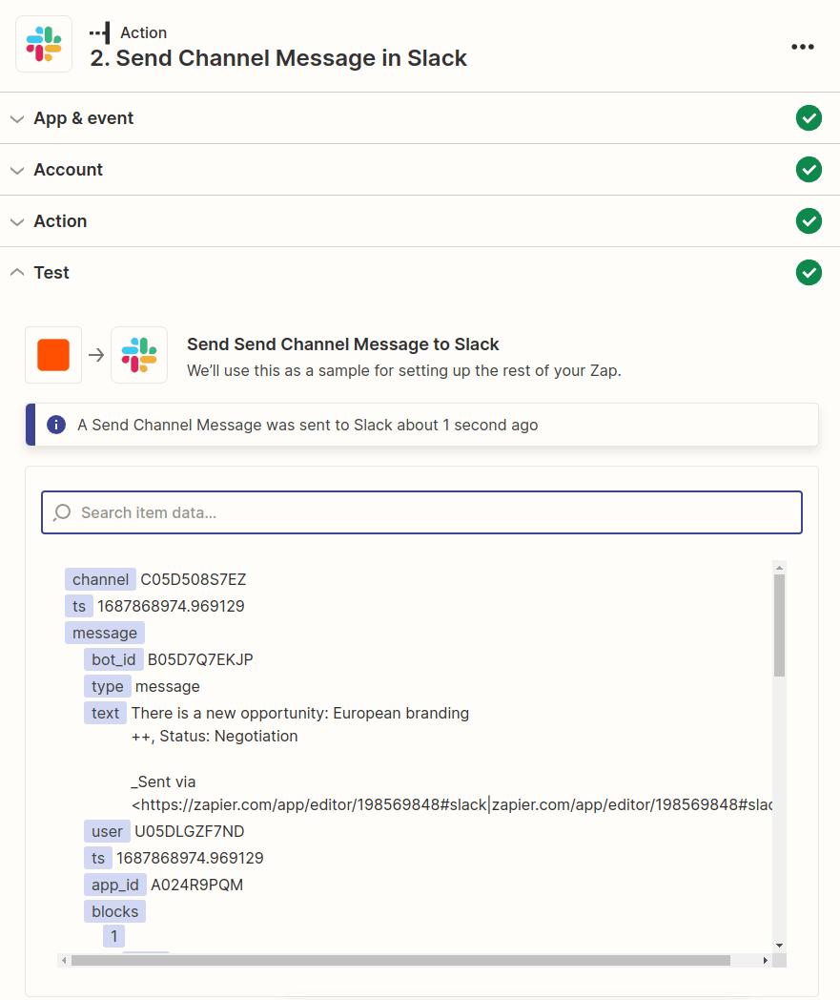
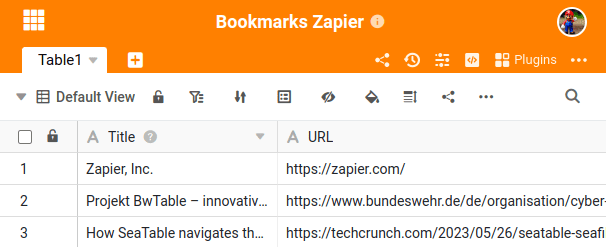
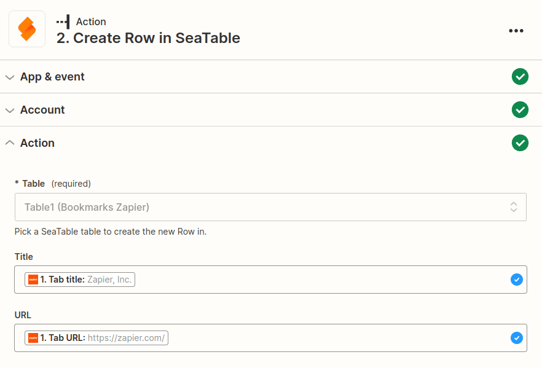

Zapier é uma plataforma de automação que lhe permite ligar o SeaTable a muitas outras aplicações e serviços. Em apenas alguns minutos e sem qualquer conhecimento de programação, pode utilizar o Zapier para criar interfaces com serviços como Dropbox, Shopify, MailChimp, Calendly, Jotform, Hubspot e muito mais. Estas interfaces criadas pelo Zapier são designadas por **Zap**, em que cada Zap tem uma aplicação como _acionador_ e uma aplicação como _ação_. O _acionador_ fornece a informação, que é depois processada em uma ou mais _acções_.

Neste artigo, aprenderá a criar zaps sofisticados com o SeaTable que podem atualizar e criar novos conjuntos de dados do SeaTable.

## Noções básicas do Zapier

A estrutura básica de um Zap é que existe sempre uma aplicação de acionamento e uma ou mais aplicações de ação. Sempre que ocorre um determinado evento na aplicação de acionamento, é automaticamente desencadeada uma ação na aplicação de ação.

Alguns exemplos de Zaps podem ser:

- Sempre que é criada uma nova linha no SeaTable (Trigger), é criado um compromisso correspondente no Google Calendar (Ação).
- Sempre que um novo subscritor é adicionado no MailChimp (acionador), é criada uma nova linha para esse subscritor no SeaTable (ação).
- Sempre que recebe um novo seguidor no Instagram (acionador), é criada uma nova linha para esse seguidor no SeaTable (ação).

Para criar um Zap com o SeaTable, é necessário [registar-se no Zapier](https://zapier.com/app/login) (ou [criar](https://zapier.com/sign-up) uma [conta gratuita](https://zapier.com/sign-up)). Pode então começar a criar o seu primeiro Zap.

## Exemplo 1: Criar um Zap com o SeaTable como um gatilho para enviar uma mensagem do Slack

Neste exemplo, usamos o modelo [CRM & Sales](https://seatable.io/pt/vorlage/pwl4sfutr06dstr9amtlag/). Usando o Zapier, queremos que uma mensagem seja publicada no nosso canal do Slack para cada nova entrada na tabela _Oportunidade_.

### Passo 1: Criar o acionador (SeaTable)

Inicie sessão na sua [conta Zapier](https://zapier.com/app/login) e crie um novo Zap. Seleccione SeaTable como a aplicação e seleccione o tipo de evento **New or Updated Row**.

O passo seguinte é ligar a sua conta SeaTable ao Zapier (ou selecionar uma conta SeaTable já ligada). Se ainda não tiver um token de API, precisa de [gerar](https://seatable.io/pt/docs/integrationen/zapier-api-tokens-sign-in/) uma [chave de API](https://seatable.io/pt/docs/integrationen/zapier-api-tokens-sign-in/) que introduz no Zapier.

Depois de selecionar a conta adequada, ser-lhe-á pedido que configure as opções de configuração específicas do acionador. Com o SeaTable como acionador, temos de especificar a tabela e a vista clicando no menu pendente e seleccionando as opções adequadas (neste caso, queremos a tabela "Oportunidades" e a vista "Todas as oportunidades").

No passo seguinte, o Zapier pedir-lhe-á para testar o seu acionador. Se tudo funcionar, ser-lhe-ão mostradas algumas das suas linhas do SeaTable e poderá continuar a configurar o seu Zap.

No gráfico seguinte, pode ver a pré-visualização de três linhas da sua tabela. Não se confundir com a exibição dos resultados. Em vez dos nomes reais das colunas, aparecem aqui os identificadores técnicos das colunas, como **coluna:589r**. Isto é bastante normal e, quando configurar a ação seguinte, ser-lhe-ão apresentados novamente os nomes correctos das colunas.

### Passo 2: Criar a ação (Slack)

No segundo passo, ser-lhe-á pedido que seleccione uma aplicação de ação. Procure o _Slack_ e seleccione a aplicação Slack. Para Evento, seleccione _Enviar mensagem de canal_ para que todos sejam informados sobre a nova entrada no SeaTable.

O próximo passo é ligar a sua conta Slack ao Zapier (ou selecionar uma conta Slack já ligada).

De seguida, é necessário configurar o modelo da mensagem. Existem várias opções de personalização aqui, mas pelo menos é necessário definir um canal de destino e uma mensagem.

Ao criar a mensagem do Slack, é possível incluir texto simples e dados dinâmicos do conjunto de dados do SeaTable recebido. Para isso, são mostrados os dados gerados pelo seu acionador como um exemplo. Um menu suspenso ajuda você a inserir os valores apropriados do seu acionador. Naturalmente, esses valores dinâmicos serão substituídos por novos valores durante a próxima execução.

Quando tiver terminado de criar a mensagem do Slack, passe para o próximo passo. O Zapier criará um resumo para que possa verificar se tudo está bem. Certifique-se de que testa a ação antes de continuar.

### Passo 3: Publicar o Zap

Se o Zapier conseguiu entregar com êxito a mensagem do Slack, só precisa de ativar o seu Zap para que também seja notificado no Slack de todas as futuras entradas do SeaTable.

Parabéns. Acabaste de criar o teu primeiro Zap.

## Exemplo 2: Criar um Zap com o SeaTable como uma ação para guardar marcadores

O exemplo seguinte mostra como é possível guardar facilmente o site atualmente aberto como um marcador no SeaTable utilizando a [extensão Zapier para Chrome](https://zapier.com/apps/zapier-chrome-extension/integrations). Para poder guardar as entradas através do Zap, primeiro tem de criar uma base. Para manter o exemplo simples, esta base tem apenas duas colunas de texto.

Em seguida, criamos um novo Zap e seleccionamos _Zapier Chrome Extension_ como o acionador e o evento _New Push_.

A configuração da _ação_ também não é difícil. Crie um [token de API](https://seatable.io/pt/docs/zapier-integration/zapier-api-tokens-sign-in/) para a base que acabou de criar e configure o título e o URL para serem armazenados nas colunas apropriadas do SeaTable. Por fim, teste o Zap e publique-o.

Agora pode instalar a extensão Zapier para Chrome e guardar o sítio Web atual na sua lista de favoritos pessoais com apenas dois cliques.

Parabéns. Criou um Zap com o SeaTable como _Ação_.

---

