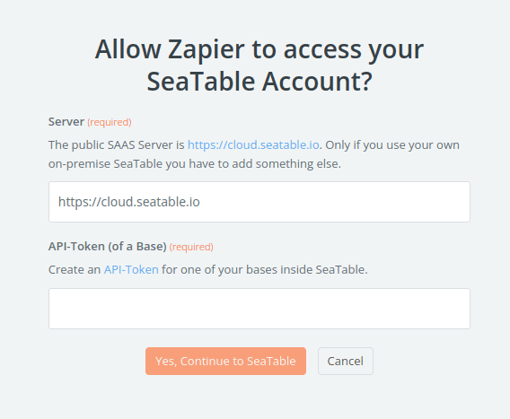
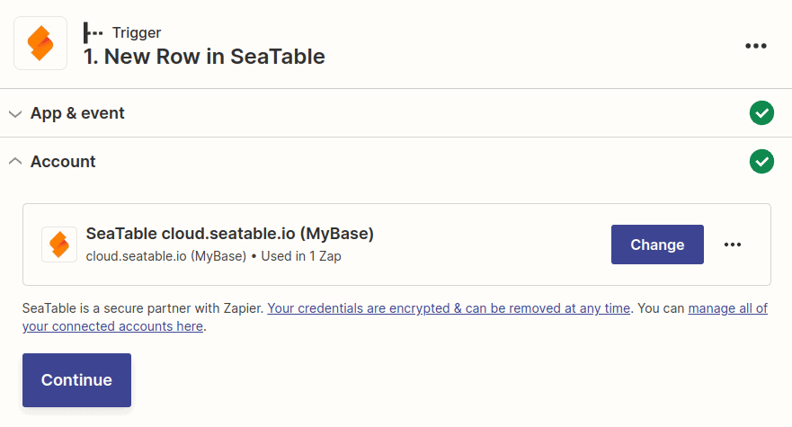

Once you start using the SeaTable app in Zapier, you need to allow Zapier to access one of your bases. To do this, you create an [API token]() in SeaTable and use it in Zapier. This help article shows you what to look out for.

## Zapier requires registration

Once you use SeaTable as a trigger or as an action in one of your zaps, you need to tell Zapier which SeaTable system and base to use. Once you select SeaTable as part of your Zap, you will be prompted to connect to SeaTable.

Once you click **Sign in**, a new window will open where you need to enter both the URL of the SeaTable system and an API token for one of your bases.

Create an API token for one of your bases and enter it in this form. To [learn]() how this works, [see this help article]().



## Start building your Zap

After entering a valid API token, you can start building your zap. For future zaps, this connection is now always available to you without having to enter the API token again.

