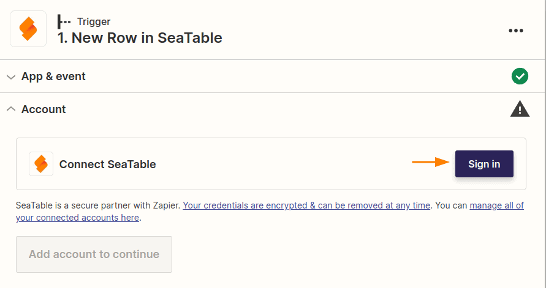
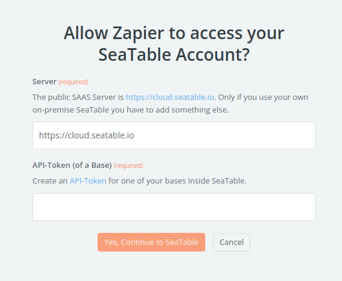
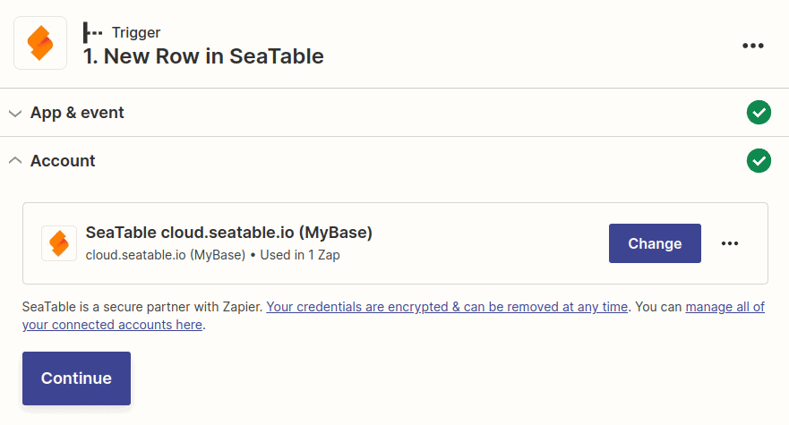

Dès que vous utilisez l'application SeaTable dans Zapier, vous devez autoriser Zapier à accéder à l'une de vos bases. Pour cela, vous créez un [jeton d'API](https://seatable.io/fr/docs/seatable-api/erzeugen-eines-api-tokens/) dans SeaTable et l'utilisez dans Zapier. Cet article d'aide vous montre ce à quoi vous devez faire attention.

## Zapier nécessite une inscription

Dès que vous utilisez SeaTable comme déclencheur ou comme action dans l'une de vos Zaps, vous devez indiquer à Zapier quel système SeaTable et quelle base vous souhaitez utiliser. Dès que vous sélectionnez SeaTable comme partie intégrante de votre Zap, vous êtes invité à vous connecter à SeaTable.

Dès que vous cliquez sur **Sign in**, une nouvelle fenêtre s'ouvre dans laquelle vous devez saisir à la fois l'URL du système SeaTable et un jeton API pour l'une de vos bases.

Créez un jeton API pour l'une de vos bases et inscrivez-le dans ce formulaire. Pour savoir comment cela fonctionne, [consultez cet article d'aide](https://seatable.io/fr/docs/seatable-api/erzeugen-eines-api-tokens/).



## Commencez à construire votre zap

Après avoir saisi un jeton API valide, vous pouvez commencer à construire votre zap. Cette connexion sera toujours disponible pour les futurs zaps, sans que vous ayez à saisir à nouveau le jeton API.

