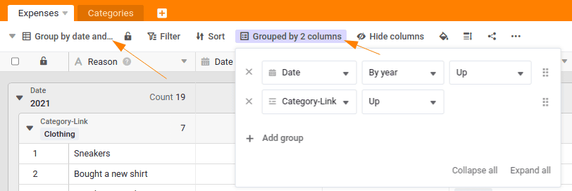

Ha creado un sólido sistema de gestión de gastos que ya calcula automáticamente el gasto total por categoría. Ahora conocerá otra función de SeaTable: **las vistas**.

Las vistas permiten utilizar filtros, ordenar, agrupar y ocultar información para determinar qué datos se muestran en una tabla. Las vistas se aplican siempre por tabla y puede crear tantas vistas como desee. Esto significa que siempre recibirá la información que le interesa.

Por ejemplo, puede crear una vista que sólo muestre los gastos superiores a 100 euros y los ordene por fecha. Esto le permite hacer un seguimiento de los gastos más grandes.



## Crear una vista adicional con una agrupación

Cambiar a la mesa `Expenses` y cree una nueva vista. Elija un nombre que indique claramente el propósito de la vista, como por ejemplo `Group by date and category`.

Cada vista recién creada no contiene inicialmente ninguna agrupación, ordenación o filtro. Ahora queremos cambiar esto:

1. Agrupar los datos en la columna `Date` por año.
2. A continuación, agrupe los datos según `Category-Link`.

## Crear una vista con filtro y agrupación

Ahora que ya dominas la agrupación de datos, es hora de filtrar los datos mediante una vista.

Crear una nueva vista con el nombre `Clothing Expenses by Year`para mostrar el gasto anual en ropa:

1. Añade un filtro: `Category-Link` contiene `Clothing`para mostrar sólo las entradas de esta categoría.
2. Agrupe los datos filtrados por año.

Ahora, con sólo unos clics, ha creado una vista que presenta claramente sus gastos en ropa, agrupados por año.

## Experimente con otros puntos de vista

Con esto concluye este curso en línea, que es también el comienzo de su viaje con SeaTable. Tómese unos minutos para experimentar con otras vistas - entenderlas es uno de los aspectos más importantes del uso de SeaTable.

Le animo a conocer mejor SeaTable. Ya ha creado una potente herramienta, ¡pero hay mucho más por descubrir!

Cuando hayas experimentado lo suficiente, intenta completar el cuestionario y gana tu premio en el foro de nuestra comunidad.

## Artículo de ayuda con más información

- [¿Qué es una vista?]()
- [Agrupar, clasificar y filtrar]()
- [Crear una nueva vista]()
- [Puntos de vista]()
- [La barra de estado y sus funciones]()
