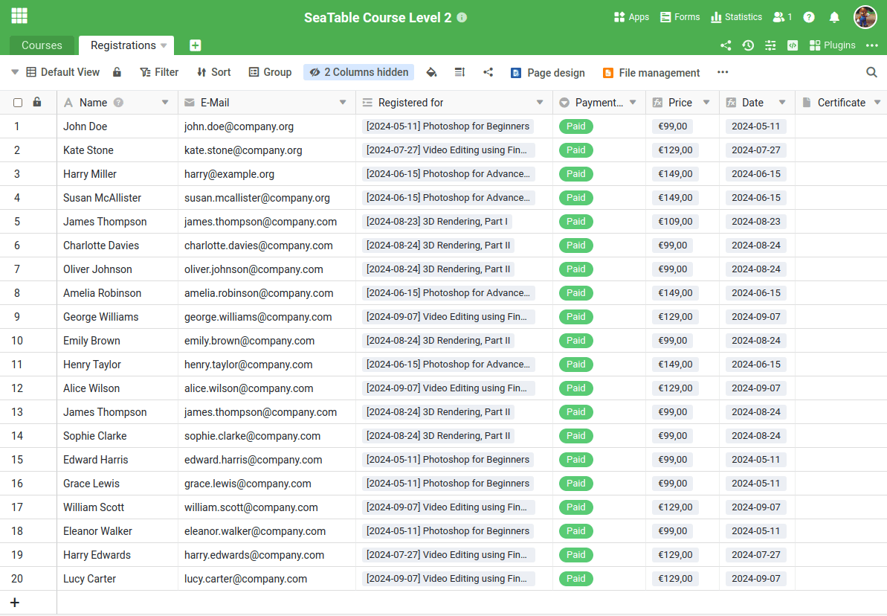
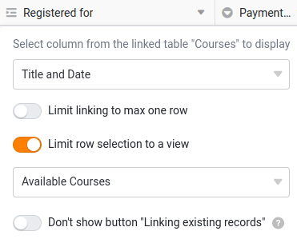

Before you can map a new business process in SeaTable, you must first create the appropriate table structure. This is the only way to record the data required for the process in a meaningful way and process it efficiently later. Although you can be inspired by the numerous templates, it is usually necessary to think through the process in detail and clearly define the relevant data.

Since this course is about managing online services, we need two central tables:

- A table for recording the course offerings
- A table for the participants

In the first course, you have already learned how to create a base with different column types. We will therefore skip this step and start directly with a prepared base.

Download the following file to your PC and import it as a new base on the SeaTable start page:

<a href="/SeaTable-Course-Level-2.dtable" download>SeaTable Course Level 2.dtable</a>

Even if you do not have to create the base yourself, it is important that you familiarize yourself intensively with the structure. New column types have been used that you may not be familiar with from the previous course.

## The components of the base

At first glance, the base looks quite clear. It only consists of:

- 2 Tables
- 18 Columns
- 3 views
- 1 Web form

But don't be fooled by its simplicity: This structure is amazingly powerful. Below I explain why we have designed the base in this way.

### Your course offer at a glance

In the table `Courses` you will find all the important information about your offers. Each row represents a course or service that you offer. The individual columns provide detailed information, such as

- Course name
- Date and place of the course
- Number of registered participants
- Status of the course (fully booked or places still available)

This structured overview allows you to keep track of your courses and participant numbers at all times.



### Everything you need to know about your course participants

In the table `Registrations` all data on the people who have registered for your courses is recorded. Each row represents one participant and contains the following information:

- Name of the participant
- E-mail address
- The course for which the person has registered
- Payment status (whether payment has already been made)

This table gives you a clear overview of the current registration status and the status of payments at all times.



## Other special features

Some functions of this base can only be understood through certain configurations. Please read the following explanations carefully so that you can better understand the following sections.

### Formula columns

In the table `Courses` you will find two important formula columns, the benefits of which I would like to explain to you:

- ` Title and Date`
- ` Status`

` Title and Date` is an auxiliary column that links the values from the "Title" and "Date" columns. The formula used is very simple and only combines the course title and the course date.

At first glance, this column seems superfluous, as it only combines existing data. But trust me: if we analyze the registration form right away, you will understand why this column is extremely useful.

---

The formula column ` Status` automatically determines whether there are still places available in a course or whether the course is already fully booked. The logic behind this is relatively simple, but could also take the event date into account when used productively.



### View for selecting available courses

In the table `Courses` there is a special view called ` Available Courses`. This view filters the formula column ` Status` and only shows courses for which places are still available. Courses that are fully booked are automatically hidden.

This view is locked against further editing to ensure that it remains unchanged. It plays an important role as it determines the selection options in the link column ` Registered for` limited.

If we take a closer look at the registration form, it becomes clear why this view is so helpful.

### Colored marking of rows and columns

SeaTable offers the option of highlighting rows, columns and cells in color. Two such effects are already integrated in this template:

- The rows courses are marked according to their status: Courses with free places are highlighted in green, while fully booked courses are marked in red.
- The course prices are graded by color depending on the amount: The more expensive the rate, the darker the marking.

## Familiarize yourself with the base

Take enough time to explore the base in detail. If you are still unfamiliar with certain functions, do not hesitate to read the linked help articles.

## Help article with further information

- [Creating a base from a DTABLE File]()
- [Basics of SeaTable formulas]()
- [Color marking of rows]()
- [Lock Views]()
