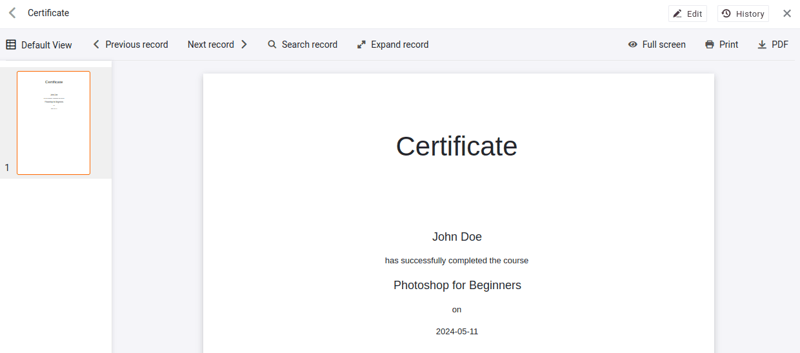

Une fois votre prestation terminée, vous souhaitez parachever le processus en envoyant un dernier e-mail aux participants. Cet e-mail peut avoir différents contenus, comme par exemple

- Une attestation de participation
- Un remerciement pour votre participation
- Une demande de feedback
- Un code de bon pour le prochain cours
- …

## Créer et envoyer une confirmation de participation

Dans cette section, nous utiliserons SeaTable pour générer une confirmation de participation au format PDF et l'envoyer par e-mail aux participants.

### Lettre en série avec le plugin de conception de page

SeaTable propose quelques plug-ins qui vous permettent d'ajouter des vues et des fonctionnalités supplémentaires à vos données. Le plugin de conception de pages permet de créer des documents PDF, comme une lettre en série dans Microsoft Word.

Ce plugin vous permet de créer des modèles qui contiennent à la fois des contenus statiques (comme des textes ou des logos) et des données dynamiques issues de votre base. Chaque ligne de la base peut générer un document individuel.



Pour ce cours, nous avons déjà préparé un modèle simple pour créer une attestation de participation. Le nom, le cours et la date du cours sont automatiquement insérés, tandis que le reste du texte reste inchangé.

Prenez quelques minutes pour explorer les possibilités du plug-in. Essayez par exemple d'ajouter un logo ou un graphique à votre signature.

Si vous cliquez sur ` PDF` le PDF généré est enregistré sur votre PC.

{{< warning  headline="Les modèles se réfèrent toujours à un tableau"  text="Lors de la création d'un nouveau modèle, les données ne peuvent être utilisées qu'à partir d'un seul tableau. Si vous avez besoin de données provenant d'une colonne liée, vous devez les inclure via des colonnes de consultation. C'est la raison pour laquelle, dans le tableau `Registrations` il existe trois colonnes de recherche masquées. Ces colonnes ne sont nécessaires que pour le plug-in de conception de page et peuvent donc rester masquées." />}}

### Envoi par e-mail

Bien entendu, vous ne souhaitez pas télécharger manuellement le PDF et le charger à nouveau pour l'envoyer par e-mail. Au lieu de cela, vous pouvez utiliser un bouton dans le tableau `Registrations` qui exécute deux actions à la suite :

- ` Create PDF and save to column`
- ` Send email`

La configuration de ces actions devrait maintenant vous être familière. Lors de la création du PDF, vous choisissez le modèle souhaité et la colonne dans laquelle le document doit être enregistré. Lors de l'envoi du courriel, vous indiquez la colonne à partir de laquelle la pièce jointe doit être envoyée.



### Quelques mots sur la gestion des fichiers

Dans SeaTable, les fichiers et les images ne sont pas stockés directement dans les cellules, mais dans le magasin de données central de la base. Les cellules contiennent uniquement des références aux fichiers correspondants. Cette gestion centralisée présente plusieurs avantages :

- Les fichiers peuvent être utilisés plusieurs fois sans devoir les télécharger à nouveau.
- Même si vous supprimez un fichier d'une cellule, il reste disponible dans la gestion centrale jusqu'à ce que vous le supprimiez définitivement.

Prenez quelques minutes pour vous familiariser avec la gestion des fichiers dans SeaTable. Pour plus d'informations, consultez les articles d'aide en lien à la fin de cette section.

## Article d'aide avec plus d'informations

- [Instructions pour le plugin de conception de pages]()
- [Enregistrer un document PDF par un bouton dans une colonne]()
- [La colonne des fichiers]()
- [La gestion des fichiers d'une base]()
