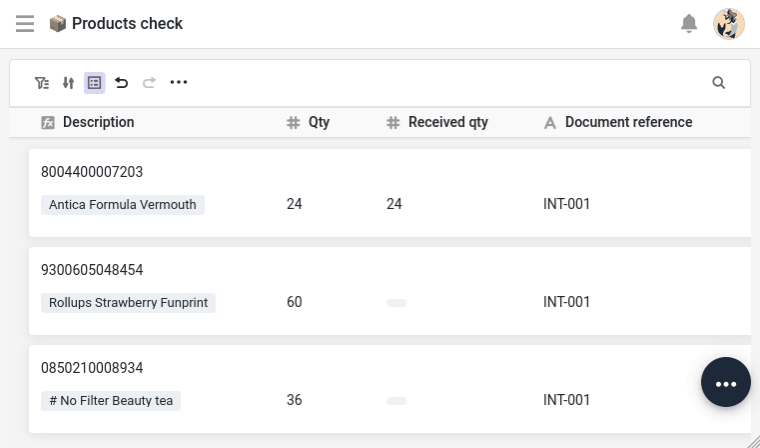

Your line items are in the base and linked to their products. Now for the receiving itself: recording what actually came off the truck, passing it on to your stock, and making sure somebody picks it up when the delivery does not match. Three jobs — and you will use two different tools, which is the whole point of this step.

## Receiving on the dock

In the field, you don't receive goods from a spreadsheet grid. Your base ships with a small `Delivery check` app containing the `📦 Products check` page, designed for a tablet. It lists your delivery lines grouped by whether they have been validated, so the ones still to receive sit at the top. Open the app and, for each line, fill in two things:

- `Received qty`: the quantity you actually count.
- `Status`: the state of the batch — `As expected` if it's fine, otherwise `Too many`, `Too few`, `Missing` or `Damaged`.

Mark at least one line as something other than `As expected` — you will need a delivery with a problem later in this step.





## Your first script

What is left is moving the stock: adding what you received to the `Stock` of the product concerned. Note the verb — adding. `Stock` is not a value to be decided, it is a running total: what the product held before, plus what just came off this truck, and it will move again with the next delivery. It cannot be recomputed from this line, because it does not belong to this line — it belongs to the product, which had a stock long before this delivery and will see movements this course never shows you.

So whatever does the job has to read the product's current `Stock`, add to it, write the result back — and never do it twice on the same line. That chain is where a script earns its place. Along the way it also settles what counts: a batch marked `Damaged` or `Missing` adds nothing to what you can sell, while `Too many` and `Too few` add what you actually counted rather than what was ordered.

This is the arbitration you will make again and again: the built-in actions are quicker to set up and easier to maintain, code is better when a job has to read, decide and write in one breath. Neither is the **advanced** option — they are two tools, and the interesting skill is knowing which one a given job calls for.

SeaTable lets you write scripts in two languages: Python and JavaScript. Throughout this course, we use Python — one of the most widespread languages for automation and data processing, known for its readability, and therefore a good entry point if you're just starting out. What you learn here carries over easily to JavaScript if you prefer it.

The editor is built into your base: nothing to install. And a script there enjoys a precious asset, the `context` object, which gives it access to the base and to the row it was started from, without you handling a single key.

First, the connection to the base. Thanks to `context`, there is no token to paste: SeaTable provides the credentials on the fly.

```
from seatable_api import Base, context

base = Base(context.api_token, context.server_url)
base.auth()
```

Then the row that launched the script, and the small piece of judgement it makes along the way — how much of what arrived is actually sellable:

```
row = context.current_row

if row.get('Validated'):
    print('This line has already been validated. Nothing to do.')
else:
    status = row.get('Status')
    if status in ('Damaged', 'Missing'):
        delta = 0
    else:
        delta = row.get('Received qty') or 0
```

Notice the first two lines: before anything else, the script checks whether this line has already been validated, and stops if it has. Adding to a stock is not a replayable gesture — run it twice and you have credited yourself goods that never arrived. A guard like this one costs two lines and saves you a wrong stock.

Finally, reach the product this line refers to, add the delta to its `Stock`, and mark the line as done:

```
    linked = row.get('Product') or []
    if not linked:
        print('This line is not linked to a product yet. Nothing to update.')
    else:
        product_id = linked[0]['row_id']
        product = base.get_row('Products', product_id)

        base.update_row('Products', product_id, {'Stock': (product.get('Stock') or 0) + delta})
        base.update_row('Line items', row['_id'], {'Validated': True})

        print('Stock updated by', delta)
```

There is no searching to do here: the ` Product` column already holds the product, and the script reads its identifier straight from the link your automation set in step 2. That is what a link is for. The guard above it is worth the two lines all the same — a line whose reference matched nothing would arrive here with no product attached, and you would rather read that in the log than crash on it.

{{< warning headline="Keep your credentials out of the code" text="In a SeaTable script, never hard-code a token. Going through context.api_token and context.server_url means the secret never exists in the file itself, so it cannot escape through an export, a screenshot or a snippet you paste somewhere. That is not the same as hiding it from whoever opens the script — anyone allowed to run it could print the token. Where the secret lives, and who may run the code, are two separate questions, and the second one is answered by access rights, not by the code." />}}

Those three pieces are one script. Here it is whole, which is what goes into the editor:

```python
from seatable_api import Base, context

base = Base(context.api_token, context.server_url)
base.auth()

row = context.current_row

if row.get('Validated'):
    print('This line has already been validated. Nothing to do.')
else:
    status = row.get('Status')
    if status in ('Damaged', 'Missing'):
        delta = 0
    else:
        delta = row.get('Received qty') or 0

    linked = row.get('Product') or []
    if not linked:
        print('This line is not linked to a product yet. Nothing to update.')
    else:
        product_id = linked[0]['row_id']
        product = base.get_row('Products', product_id)

        base.update_row('Products', product_id, {'Stock': (product.get('Stock') or 0) + delta})
        base.update_row('Line items', row['_id'], {'Validated': True})

        print('Stock updated by', delta)
```

## Run it at the right moment

A script can be started in several ways; here you tie it to a button. `Line items` already carries one, ` Validate` — the receiving page of your app shows it, so it had to be there from the start, and a button cannot exist without an action. The one it arrived with does nothing but open a web page. Open the column's settings, delete that placeholder, and add a `Run Python script` action in its place, pointing at the script you have just written. The operator checks a line, clicks `Validate`, and the stock follows.

Before you press it, open `Products` and note the `Stock` of the product your line refers to: you will want to know where you started from. Back in `Line items`, click `Validate` on that line, then follow its ` Product` link through to the product. The stock has risen by exactly what you counted.

Now click `Validate` a second time, and go and look once more. Nothing has moved. The guard at the top of your script did its work: the line was already validated, so it stopped before adding anything.

That back and forth is worth a thought in itself. You have just walked by hand the link you built in step 2 — the same path your script travels in a single line.

## Try it yourself: when something is off

A compliant delivery needs nobody. A delivery that came up short, or arrived damaged, needs someone to take it up with the supplier — and that someone should not have to go looking for it.

The criterion is already in your base. On `Documents`, `Lines to review` counts the line items of that delivery whose `Status` is neither empty nor `As expected` — the two conditions matter: a line nobody has received yet has no status, and it is not a problem, it is simply not done. Greater than zero means there is something to settle.

Now, the thing worth learning here. You cannot start an automation from that column. `Lines to review` is calculated: SeaTable recomputes it whenever the linked lines change, and a recalculation is not an event a trigger can watch. This is not a quirk of this particular base — it is true of every formula and every link-formula column you will ever build.

So you do not react. You **sweep**: a scheduled automation that passes over your documents, keeps the ones matching a condition, and acts on those.

> Trigger: At a given time, for the records that match a condition
>
> Execution frequency: Every day, at whichever hour suits you
>
> Condition: `Lines to review` is greater than 0
>
> Action: Assign a `Reviewer`

Build it exactly like that, then use `Run now` in the automation editor rather than waiting for the night: the delivery you flagged earlier gets its reviewer.

Now press `Run now` again. You are notified a second time, for a dispute that is already assigned — and it would happen again every single night. Nothing in your rule says the document has been dealt with. Add a second condition, `Reviewer` is empty, and run it once more: silence. The document has left the set.



On your own base you are alone, so you assign the delivery to yourself. In a real team — as you saw in [Online Course 3 – Collaboration]() — this would be the buyer who placed the order, the one person who calls the supplier once and settles every line of that delivery in a single conversation.

Now open the online courses plugin in your base and select **Step 3**. It starts by giving your rule something to find: it puts a discrepancy on another line, then asks you for a `Run now`. What it verifies afterwards is not only that a reviewer is there, but that an automation, and not you, is the one that put it there — which you would otherwise have to go and dig out of the row's history.

## Going further

Replay the receiving with a batch marked `Damaged` — on a line you have not validated yet, and note the product's `Stock` **before you touch anything**: without that number, you will have nothing to compare. Fill in a received quantity (you normally would not bother; here you do it precisely to watch what happens), click `Validate`, then open the product record. The stock has not moved: your script checked the status before adding anything, and damaged goods do not join what you can sell.

Had you picked an already validated line, the stock would not have moved either — but for the other reason, the guard stopping the script before it ever read the status. The log tells you which of the two you just watched.

Then put your rules side by side: some fire the instant a row appears or changes, this last one passes by at a chosen hour. Between them they cover the two ways of setting an automation off — catching an event, or going over a set at a chosen moment. That is the first question to settle for any automation you write from now on, and, as you have just seen, what you are able to react to often settles it for you.

## Help article with further information

- [Scripts in SeaTable]()
- [SeaTable Developer Manual](https://developer.seatable.com/)
- [The collaborator column]()
- [Online Course 3 – Collaboration]()
