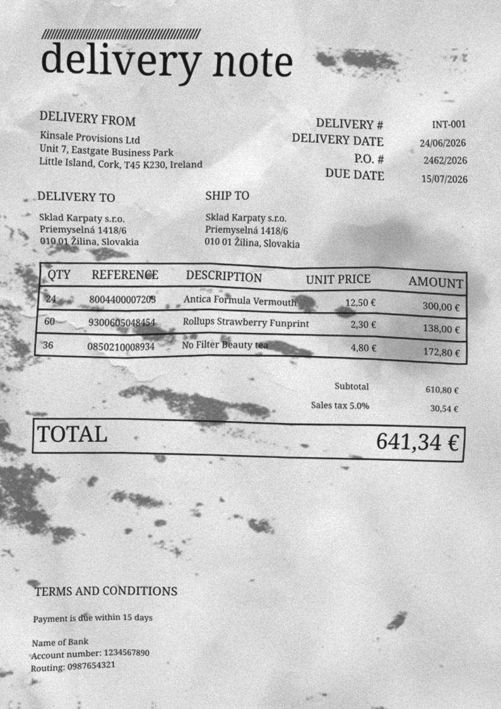

In step 2, the delivery lines simply appeared, already typed up, as if the supplier had sent through a tidy list of what went onto the truck. That is the textbook case — and it is worth asking where such a list would actually come from. A delivery note seldom lands as a neat file in your inbox. More often it is a slip of paper the driver hands over at the dock, which the warehouse worker snaps with a phone. That image is nothing like a ready-to-use file.

Now you are going to let SeaTable do that work for you: read the photo and pull out the line items, all on its own. What is worth noticing is not so much what the AI does — a long enough Python script and some image analysis could get there too — but what the difficult half costs you here: a few sentences of plain language. Turning its answer into line items still takes a script, and this one we hand you; but reading a photographed slip of paper and making sense of it, you simply ask for. How little that asking costs is also what makes it tempting to lean on, which is why this is the step to stay clear-eyed about what AI can, and cannot, do.

It all happens in an automation triggered when a new document arrives, in three steps: **read**, **extract**, **create**. Your base does not ship with it either — build it on `Documents`, the way you built your first one in step 2:

> Trigger: New row in the `Documents` table
>
> Condition: `File` is not empty

The condition matters as much as it did in step 2. The form you are about to use creates the row and attaches the document in one operation, so the file is there the moment the rule fires; and without the condition, the chain would set off on a document that arrives with no file at all — as one does in step 7.

Leave it at that for now: you add the three actions as you go, one per section below.

{{< warning headline="This step needs an AI-capable SeaTable" text="On SeaTable Cloud, artificial intelligence is included and there is nothing to set up. On a self-hosted system it only works once an administrator has [installed the SeaTable AI component](https://admin.seatable.com/installation/components/seatable-ai/) and pointed it at a model. Without it, the two AI actions below will not run — read the step for the reasoning, but leave the delivery in your base as it is instead of rewinding it, and the rest of the course continues unchanged. Step 5 comes back to this: whoever does the office half, it ends the same way — somebody checks the lines and tells the dock they are ready." />}}


## Read the document

The delivery note sits in the `File` column of your document. Add a first action to your rule:

> Action: Run AI
>
> Function: OCR

It asks for no instructions of its own — you only tell it which column to read, `File`, and the column where to drop the result, `OCR text`. SeaTable extracts all the text from it: references, quantities, whatever is on the paper — but raw, as-is.

```
delivery note

DELIVERY FROM
Kinsale Provisions Ltd
Unit 7, Eastgate Business Park
Little Island, Cork, T45 K230, Ireland

DELIVERY # INT-001
DELIVERY DATE 24/06/2026
P.O. # 2462/2026
DUE DATE 15/07/2026

DELIVERY TO
Sklad Karpaty s.r.o.
Priemyselná 1418/6
010 01 Žilina, Slovakia

SHIP TO
Sklad Karpaty s.r.o.
Priemyselná 1418/6
010 01 Žilina, Slovakia

QTY REFERENCE DESCRIPTION UNIT PRICE AMOUNT
24 8004400007203 Antica Formula Vermouth 12,50 € 300,00 €
60 9300605048454 Rollups Strawberry Funprint 2,30 € 138,00 €
36 0850210008934 No Filter Beauty tea 4,80 € 172,80 €

Subtotal 610,80 €
Sales tax 5.0% 30,54 €

TOTAL 641,34 €

TERMS AND CONDITIONS
Payment is due within 15 days

Name of Bank
Account number: 1234567890
Routing: 0987654321
```

That is the recognition of `INT-001`, the delivery note already sitting in your base — and take it for what it is, a textbook case: that note was produced by a computer, so the reading is an easy one. A slip of paper photographed at the dock gives something rougher, and you will see it for yourself further down, when you receive this delivery the way a warehouse really does.

Clean or not, though, what comes back is the same in kind: text, and text is not data. Your three product lines are in there, somewhere between a supplier's address, a due date and a bank account. You read that at a glance; your base can do nothing with it.

## Extract the line items

This raw text needs to be structured: isolating each product and its quantity. That is the job of a second action — the same `Run AI`, with another function:

> Action: Run AI
>
> Function: Custom

Notice what it does not ask for: an input column. The OCR action needed one; this one does not, because the instruction you are about to write goes and fetches what it needs itself. All it wants besides the prompt is where to put its answer — `JSON`.

This one you do instruct, precisely. Paste the following into `Custom prompt`, as-is:

```
From {OCR text}, extract the purchase order reference (look for "purchase order", "PO" or "P.O.") and the delivery reference and, for each product, its product reference and quantity. Write valid JSON (double quotes) into the {JSON} column, as plain text, no code block, with this exact shape:
{
    "delivery": "delivery reference",
    "order": "purchase order reference",
    "products": [
        { "ref": "product reference", "qty": product quantity as a number }
    ]
}
```

The instruction asks the AI to answer in JSON — a format your script will read back unambiguously. On the note already in your base, what lands in the `JSON` column is this:

```
{"delivery": "INT-001", "order": "2462/2026", "products": [{"ref": "8004400007203", "qty": 24}, {"ref": "9300605048454", "qty": 60}, {"ref": "0850210008934", "qty": 36}]}
```

One line of plain text, double quotes, quantities as numbers: exactly what the instruction insisted on. Those demands are not decoration — answer with single quotes, or wrapped in a code block, and the script that comes next can no longer read it.

## Create the line items

You already know, from step 3, what a script can do. This one reads the JSON produced by the AI and creates one line per product in `Line items`. It is provided to you, and it comes first: the action you are about to add asks which script to run, so the script has to exist before you can point at it.

```python
from seatable_api import Base, context
import json

base = Base(context.api_token, context.server_url)
base.auth()

data = json.loads(context.current_row.get('JSON'))
base.update_row(context.current_table, context.current_row['_id'], {
    'PO reference': data['order'],
    'Delivery reference': data['delivery'],
})
lines = [{
    'Product reference': p['ref'],
    'Qty': int(p['qty']),
    'Document reference': data['delivery'],
} for p in data['products']]
if lines:
    base.batch_append_rows('Line items', lines)
```

Now your rule can be finished. Add its third and last action:

> Action: Run Python script
>
> Script: the one you have just created

And here is the elegance of the whole thing: each line created sets off the automation you built in step 2. The new lines attach themselves to their product and their document, without you touching that rule again. From a photo to linked line items, with not one manual entry.

That hand-off deserves a second look, because it is not a given. An automation's own actions never set off another automation; what a script writes, on the other hand, is an ordinary change to the base, and every rule watching that table hears it. So the chain holds precisely because these lines come from your script and not from an action of the rule that ran it — which is also what keeps your rules from setting each other off in circles, and what lets a careless script do exactly that.

{{< warning headline="In production, the script would do the linking too" text="Watching your step 2 rule pick up the lines your script has just written is the point of the exercise here, and three lines cost nothing. In a real process you would most likely put the linking inside the script instead. Each line created is one automation run, and those runs are metered: every subscription comes with a monthly allowance, and a rule fired row by row also has a ceiling per minute that a long delivery note might reach. A script, on the other hand, can link all its lines in a single operation — one call rather than one per line, which spares your API budget as well and leaves your automation allowance to the jobs that really need an automation." />}}

## Try it yourself: rewind, and do it for real

You have the chain. What you do not have is anything to feed it: that delivery is already in your base, lines and all.

So put it back. In your base, open the online courses plugin, select **Step 4** and click `Rewind the delivery`: it removes the line items of that delivery, then the document itself, returning your base to the moment before the truck pulled in. Nothing of value is lost — those lines were a stand-in for the ones you are about to obtain properly.

Now receive the same delivery the way a warehouse really receives one — and from where it really happens. The `Delivery check` app you worked in during step 3 has a second page, `📄 New delivery note`: a short form, today's date already filled in, and a field for the document. Attach the photo of the delivery note there and submit it. Nothing else is asked of you: no reference, no supplier, not one line. Everything written on that slip is in the picture, and reading it is the machine's job now.





Then watch it run: text recognition fills `OCR text`, the AI writes its JSON, the script creates the lines, and your step-2 automation links them. And because you already saw these very lines in step 2, you are in the rare position of knowing what the right answer looks like. Compare them.

{{< warning headline="An AI action takes its time" text="Reading a photograph and writing the JSON back is far slower than an ordinary automation action — count in tens of seconds rather than the instant response you are used to, and longer on a busy day or a crowded delivery note. Nothing on screen tells you it is working, so give it a minute before you conclude that it failed. If you would rather not wait in the dark, open the execution log of the automation from the base options: a run is listed there as soon as the rule fires, with its time and status. That is what separates the two cases worth telling apart — a rule that never triggered at all, and a rule that fired and is simply still working." />}}

Look at the ` Product` column in particular. If one of the new lines has stayed empty there, nothing is broken: the recognition misread a character in that barcode — a digit swallowed, a 0 taken for an 8 — and a reference that is wrong by a single character matches no product at all. Your linking automation did its work; it simply found nothing to link.

That is worth repairing rather than tolerating, because the repair is small. `rapidfuzz` comes already installed in SeaTable's Python environment: it compares a string against a list and hands back the closest one, with a score out of a hundred. A barcode missing one digit still scores around 96 against the real reference, one digit read as another about 92, and two characters going wrong at once — which a poor photograph manages easily — takes you into the high eighties. The closest unrelated product in your catalog, meanwhile, sits somewhere in the fifties and can reach the low seventies: with enough barcodes on the shelves, one of them is bound to share a run of digits with yours. So the cut-off sits at 85, where those two stop overlapping — above it you are looking at an honest misreading worth correcting, below it at a stranger best left alone. It is also why it is not 90, which would drop a reference that took two knocks.

Here is your script again, this time with the repair built in — take it whole, in place of the one you are running:

```python
from seatable_api import Base, context
from rapidfuzz import process, fuzz
import json

base = Base(context.api_token, context.server_url)
base.auth()

# Every real reference, read once.
CATALOG = [str(p.get('Reference') or '').strip() for p in base.list_rows('Products')]

def snap(ref):
    ref = str(ref).strip()
    if ref in CATALOG:
        return ref
    hit = process.extractOne(ref, CATALOG, scorer=fuzz.ratio, score_cutoff=85)
    return hit[0] if hit else ref

data = json.loads(context.current_row.get('JSON'))
base.update_row(context.current_table, context.current_row['_id'], {
    'PO reference': data['order'],
    'Delivery reference': data['delivery'],
})
lines = [{
    'Product reference': snap(p['ref']),
    'Qty': int(p['qty']),
    'Document reference': data['delivery'],
} for p in data['products']]
if lines:
    base.batch_append_rows('Line items', lines)
```

Three things moved: the catalog is read once, before the loop, rather than for every line; `snap()` sits above the work it serves; and it is called at the single place where the line's reference is written. The rest is exactly what you already had.

Run the chain again and the orphaned line finds its product. Note what the cutoff protects you from: below it, the script keeps the reference exactly as the AI read it rather than attaching the line to a plausible-looking neighbor. A line you can see is unmatched is a small annoyance; a line silently attached to the wrong product is a wrong stock.

## AI proposes, you validate

An essential word before going further. AI is impressive, but it is not infallible: depending on the photo quality or the supplier's layout, it can get a quantity wrong, miss a line, or simply choke. That is in its nature, and no setting changes that one hundred percent.

That is precisely why the next step in your process is the human verification you already know. The lines proposed by the AI are not set in stone: they go through the receiving of step 3, where you compare what was announced against what is real. The AI's imperfection is not a flaw to work around, it is the very reason for this validation.

And what if the AI goes completely off the rails on your example? The plugin will write this delivery's lines for you — in full if the extraction produced none, corrected if it produced the wrong ones. Your progress is never blocked by a whim of the model: what the plugin checks is that the delivery's lines are back, never that the AI got them right on its own.



## Going further

Open the `JSON` the AI wrote for this delivery and find the barcode of the line that arrived without a product. Then open that line in `Line items` and read its `Product reference`. The two strings are not the same, and nothing in your base says so: the repair happened, and it left no trace. If your own reading came back clean, all the better — nothing was corrected, and you have no way of knowing that either.

So give it a trace. Take this `snap()` whole, in place of the one you are running — same job, plus a line of log for every product it looks up:

```python
def snap(ref):
    ref = str(ref).strip()
    if ref in CATALOG:
        print(f'{ref} -> read cleanly')
        return ref
    hit = process.extractOne(ref, CATALOG, scorer=fuzz.ratio, score_cutoff=85)
    if hit:
        print(f'{ref} -> corrected to {hit[0]}, score {hit[1]:.0f}')
        return hit[0]
    print(f'{ref} -> matched nothing, kept as read')
    return ref
```

You will not have to push a delivery through to read it: another note arrives in the very next step, and the log will be waiting. A correction nobody can see is a correction nobody can check — and however high the score, it remains a guess.

One last look at that function, at the line you did not write. `process.extractOne` is nothing of SeaTable's: it comes from `rapidfuzz`, as the `from rapidfuzz import process, fuzz` at the top of the script says plainly. Every library arrives with a vocabulary of its own, and its documentation is where that vocabulary is explained — [the `extractOne` function reference](https://rapidfuzz.github.io/RapidFuzz/Usage/process.html#extractone) sets out the arguments it accepts, the scorers you can hand it besides `fuzz.ratio`, and what it gives back. It is a reflex worth having with any library you meet: most of them are published on [the Python Package Index](https://pypi.org), and an entry there points you to the project's own documentation.

## Help article with further information

- [AI-powered automation actions]()
- [Execution limit for automations]()
- [Show execution log of an automation]()
- [Python scripts in SeaTable]()
- [SeaTable Developer Manual - Python](https://developer.seatable.com/python/)
- [RapidFuzz documentation](https://rapidfuzz.github.io/RapidFuzz/index.html)
