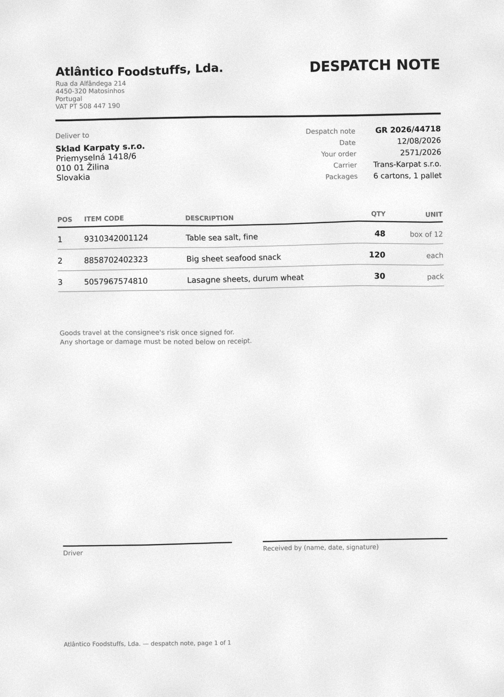

So far, everything has stayed inside SeaTable: your automations and your scripts acted on your data, and the plugin could check the result. From now on, you are going to send information out — alerting a service, a phone, another tool. The building block for that is called the webhook.

## Inbound, outbound: what are we talking about?

A webhook is an automatic phone call between two applications. When an event happens on one side, a request immediately goes out to a URL on the other side to notify it. Both directions have a name, and the name is given from where you stand: a call is **outbound** for the application that makes it and **inbound** for the one that receives it — one request, described from either end.

You are standing in SeaTable, so outbound here means SeaTable calling the outside world, which is this whole step, and inbound means the outside world calling SeaTable, a direction you will meet again in the step on the API. Point a webhook at a service and that service will file the very same call under inbound; nothing changed but the vantage point.

## See what SeaTable sends

SeaTable can trigger an outbound webhook without any code: you give it a URL, and on every event, it sends a message there. But a message to where? To observe it, the simplest way is to send it first to a test endpoint.

Open [webhooks.cc/go](https://webhooks.cc/go): the service assigns you a unique URL and displays, live, everything it receives. Copy the provided endpoint, and set up a native webhook — from the three-dots menu of your base on the Homepage — pointing to that URL. Then put that page and your base side by side — a split view, or two windows on one screen — with your base open on `Products`, because that is where the change is about to happen. Now let the plugin give the webhook something to say: open the online courses plugin, select **Step 5a**, and it will add a row there, edit it a few seconds later, then delete it again. The row arrives coloured, so it is hard to miss. Three ordinary changes, spaced so you can watch each one leave the base and land at the other end. And if nothing appears there, try moving the two pages into the same browser window before suspecting your webhook: the free Guest endpoint belongs to the browser that opened it, and it does not always follow to a second window.

What arrives is the **payload**: the packet of data SeaTable sends to describe what has just happened. Here is the first of the three:

```
{
  "event": "update",
  "data": {
    "dtable_uuid": "2b17...956",
    "row_id": "YLOdOm_EQx65xhvFBELskQ",
    "op_user": "d23...ac9c@auth.local",
    "op_type": "insert_row",
    "op_time": 1787664773.351,
    "table_id": "g17O",
    "table_name": "Products",
    "row_name": "WEBHOOK-TEST-STEP0",
    "row_name_option": "",
    "row_data": [
      {
        "column_key": "0000",
        "column_name": "Reference",
        "column_type": "text",
        "column_data": {},
        "value": "WEBHOOK-TEST-STEP0"
      },
      {
        "column_key": "o0aB",
        "column_name": "Description",
        "column_type": "text",
        "column_data": {
          "enable_fill_default_value": false,
          "enable_check_format": false,
          "format_specification_value": null,
          "default_value": "",
          "format_check_type": "custom_format"
        },
        "value": "Test product"
      },
      {
        "column_key": "N86q",
        "column_name": "Brand",
        "column_type": "text",
        "column_data": {
          "enable_fill_default_value": false,
          "enable_check_format": false,
          "format_specification_value": null,
          "default_value": "",
          "format_check_type": "custom_format"
        },
        "value": "Course 4"
      }
    ]
  }
}
```

Read the three in order and you have most of what there is to know about them. Each carries an `op_type` — `insert_row`, `modify_row`, `delete_row` — the table it happened in, the identifier of the row, the moment, and who did it. Under `row_data` sit the columns themselves, by name and by type: the row as it was written for the creation, and for the edit only the columns that moved, each with its new value next to the `old_value` it replaced. Yours will carry its own identifiers, shortened here; everything else is exactly what arrives. Nothing in it had to be asked for, either: a webhook describes the change, not the question you had in mind.

Three requests for one small errand, each about as talkative as the one above — and there is the catch. A native webhook is fixed to its base and reports every content change in it: you cannot pick the events, the tables or the columns it tells you about. The busier the base, the more the service at the other end receives — and the more of it there is to throw away.

So the round trip is yours to make and nothing is checked in the plugin this time — that is the lesson. But keep that catch in mind, because the rest of this step answers it.

{{< warning headline="A webhook address is not a secret" text="Anything that knows the address can post to it, and whatever it points at can read what your base sends — which is fine for a throwaway endpoint catching three test changes, and not fine for a warehouse. In production, set a secret key on the webhook: SeaTable then signs every request with it and adds an X-SeaTable-Signature header. The receiving service recomputes that signature and drops anything that does not match, so a stranger who has guessed your URL cannot make your systems act on an event that never happened. The sender can prove where a message came from; only the receiver can refuse the ones that cannot." />}}

If you would rather see it than take our word for it: set a secret key on your webhook, let the plugin stage one more change, and look at the headers of the request that arrives. Change the key and do it again — same payload, different signature.

## A real notification: ntfy

A raw payload on a web page is perfect for understanding, but in the field you would rather be alerted for real. This is where ntfy comes in: a service that turns a simple request into a notification on your phone.

ntfy asks for no account. Open [https://ntfy.sh/app](https://ntfy.sh/app) and click `Subscribe to topic` in the left panel to create one — a topic is a channel name that also acts as a password. Anything sent to that topic from now on appears there, live, in the browser.

That page is enough to follow this step. But a notification that waits in a browser tab is not really a notification, and the whole point of what you are about to build is to reach someone who is not at a screen — so if you want to feel it properly, this is the moment to install the ntfy app on your phone and subscribe to the same topic there. From then on the two go together: every message lands on the page and, if the app is installed, buzzes in your pocket.

{{< warning headline="Pick a topic nobody else would" text="A topic is an address and a password at once: anyone who knows it can send you notifications and read yours, so choose a long name that is hard to guess and never let sensitive information pass through it. A name like SeaTable online course 4 fails on both counts, and on a third: another learner has probably already subscribed to it, and you would each be getting the other one's notifications. The Generate name button in the Subscribe to topic panel gives you a unique one in a click." />}}

There is a lesson hiding in that. The request your script is about to send carries nothing proving who sent it, and ntfy accepts it all the same — which is exactly what a stranger who has guessed your webhook URL can do to whatever is listening at the other end. It is what the secret key is for.

Now to find the right moment to fire one. Look at who waits for what in your warehouse. The delivery note is dealt with at the office: its lines are read off the paper — by the AI chain of step 4, or by hand — and then somebody checks them against the note and declares them good. Meanwhile whoever has to count the boxes is out on the dock, with no reason to be watching a base. Between the two sits a handover, and it deserves better than someone walking across the yard: the lines of this delivery are ready, the receiving can start.

Notice that the AI changes nothing about who says so. It proposes the lines and spares somebody a long bout of typing; the person at the office still reads them against the note and signs them off. The message that leaves your base is theirs either way — which is exactly why there is one message to build here, and not two.

SeaTable can carry that message itself, and for a colleague sitting in front of the base its own notifications are the right tool. Two things push you outside of it here. A message that lives inside SeaTable waits for someone to open SeaTable, while a delivery arrives whenever it arrives. ntfy reaches a phone that is open on nothing at all. Moreover, not all of your employees are collaborators of that base, and someone who is not cannot be notified inside it at all.

## Give the office the switch

The native webhook you just saw fires on every change, and always says the same kind of thing. A script decides everything instead: what to send, when, and with what message. And the moment worth sending is precisely the one no rule can work out on its own — a person has compared the list to the note and is happy with it.

So hand that person the switch. On `Documents`, create a button column, `Notify the dock`, and attach a script to it, the same gesture as the `Validate` button of step 3:

```python
from seatable_api import context
import requests

NTFY = 'https://ntfy.sh/your-secret-topic'

doc = context.current_row
lines = doc.get('Line items') or []
note = f"Delivery {doc.get('Delivery reference')}: {len(lines)} lines ready — open the 📦 Products check page"
requests.post(NTFY, data=note.encode('utf-8'))
```

Replace the URL in line 4 with the topic you subscribed to.

Two things to remember. First, `requests` — the library that sends the request — is one of the tools already available in SeaTable scripts: nothing to install. Second, this script never opens the base: the row it was started from carries everything it sends, which is what keeps it down to four working lines.

Notice as well that the message names where to go — the `📦 Products check` page of your app — instead of linking to it. That page never moves, so whoever receives this alert twice a day has it on their home screen already, and a message that reads in one glance beats one that has to be opened to make sense. Should you ever want the link anyway, ntfy reads a `Click` header and turns the whole notification into one.

The handover runs the other way too. The dock could be the one to speak up — a note has come in, its lines are waiting to be dealt with — with the same request fired the moment the document is created. Nothing new to learn there: it is the same building block pointed in the other direction.

## Try it yourself: on a real delivery

A second note arrived today, from another supplier, and this one nobody has seen — not you, not your base. It is the delivery your notification was built for.





Use again the `📄 New delivery note` page of the `Delivery check` app to create a new document. Then comes the office half — reading the note and getting its lines into `Line items`. If you built the chain of step 4, the AI does the reading and leaves you its lines to check. If you did not, that is somebody's typing in a real warehouse; here, copying barcodes off a photograph is nobody's idea of a lesson, so open the online courses plugin at **Step 5b** and let it write the lines in for you.

However they got there, finish the way the office always finishes: read the list against the note, and press `Notify the dock`. The message lands on your ntfy page, and in your pocket if you installed the app.

That is worth a moment. The value of this step was never in who prepared the lines; it is that the person waiting on the dock finds out at the right time, from a base they may not even have open.

## Going further

Press `Notify the dock` on a document with no linked line items at all. The dock is told, in all seriousness, that zero lines are waiting — and nothing anywhere stops it. A script says what happened only in so far as you make it look: two more lines, counting the lines before it sends and refusing when there are none, are the difference between a message and a message worth trusting.

## Help article with further information

- [Creating and deleting a webhook]()
- [Webhook data structure]()
- [The secret key of a webhook]()
- [Python scripts in SeaTable]()
- [SeaTable Developer Manual - Python](https://developer.seatable.com/python/)
