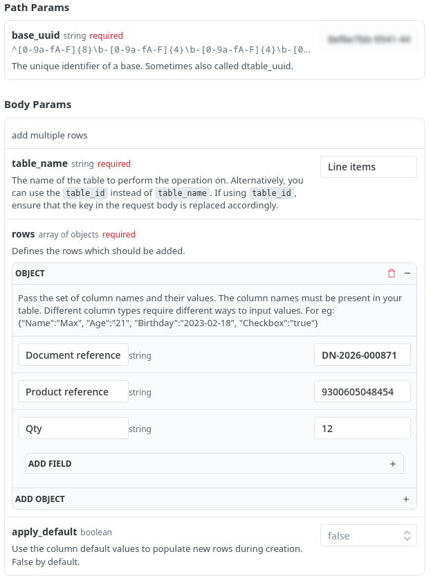

Every delivery so far has reached your base the same way: on paper, at the gate, and then read into `Line items` — by a person, or by the AI of step 4. One of your suppliers is about to change that. They are modernizing their operations, and their delivery notes no longer travel on paper. The moment the truck is loaded, their system sends it straight to you, as data. No sheet in a plastic sleeve, no photograph, nothing to decipher: the lines are simply there when you go looking. Just this one supplier, though: the rest will go on handing a printed note to your driver at the gate.

That is the subject of this last technical building block, and it reverses the direction of everything we have seen so far. Until now you took information out of SeaTable; here, something outside brings information in.

## Connecting the existing, not replacing it

Your supplier is not going to come and work in your base, and you are not going to work in theirs. What they have is a system that already knows, down to the box, what went onto that truck — the very system that printed the paper note yesterday. What you have is a base that knows what to do with those lines. The only thing missing between the two is a way to talk.

That way is the API: a door SeaTable leaves open for other programs. When the truck is loaded, their system knocks on it and drops the note's lines into your base — all at once, in a single request. Nobody re-types anything, and nothing has to be rebuilt on either side.



## Discovering the API reference

You do not have a supplier's shipping system at hand, but you can play its part. Head to the API reference, [api.seatable.com](https://api.seatable.com): it lists every operation possible on a base and lets you try them out directly. The one we are interested in adds several rows in a single call: [`Append row(s)`](https://api.seatable.com/reference/appendrows).

That call needs three things from you, and two of them sit in the same place: open the `API Tokens` dialog of your base, where you will find your base UUID and where you create an API token, with read/write permission. The third is the Base-Token that the endpoint actually asks for.

{{< warning headline="What is a Base-Token?" text="The Append row(s) endpoint asks for a Base-Token. As they serve different purposes, SeaTable handles [three different types of token](https://api.seatable.com/reference/authentication#seatables-three-tokens). The Base-Token authenticates a base API request (=base operations) like add a new row, append a row or delete a row. The most common way to get one is to [generate it from an API-Token](https://api.seatable.com/reference/getbasetokenwithapitoken) — the value you are interested in is the content of the `access_token` of the API call response." />}}

One thing has to exist before anything can be pushed: the note itself. Their system sends the whole of it — the header of the delivery first, then its lines — and we are going to split that conversation in two, so that the half you do by hand stays small enough to read. Open the online courses plugin, select **Step 7a**, and let it play the first half. A new document appears in `Documents`, reference `DN-2026-000871`, and its ` File` column is empty: there is nothing to photograph any more.

To the right of the form, enter your Base-Token and the server URL — nothing can be sent without them. Then point the call at your base via `base_uuid` and at the `Line items` table using `table_name`. The panel nests, which takes a moment to get used to: `rows` holds an `OBJECT` for each row you are adding, and inside it `ADD FIELD` gives you one column and its value. Below is what a single line looks like once it is filled in.



Create at least one row to add. Give it a `Qty`, and — more important — the two references your linking automation matches on: in `Document reference`, the `Delivery reference` of the document the plugin has just created; in `Product reference`, that of a product already in your catalog.

Right below the form, a panel writes the request call out as code. Here is the result in Python, with the `requests` library you already came across at the webhooks step:

```python
import requests

url = "https://cloud.seatable.io/api-gateway/api/v2/dtables/YOUR_BASE_UUID/rows/"

payload = {
    "table_name": "Line items",
    "rows": [
        {
            "Document reference": "DN-2026-000871",
            "Product reference": "9300605048454",
            "Qty": 12
        }
    ]
}
headers = {
    "accept": "application/json",
    "content-type": "application/json",
    "authorization": "Bearer YOUR_BASE_TOKEN"
}

response = requests.post(url, json=payload, headers=headers)
print(response.text)
```

## The API in practice

Fire the request and you will see underneath what came back:

```
{
  "inserted_row_count": 1,
  "row_ids": [
    {
      "_id": "S5nv1sJORr2Pr4NlWpssZw"
    }
  ],
  "first_row": {
    "vBRI": "DN-2026-000871",
    "0000": "9300605048454",
    "ai6E": 12,
    "_id": "S5nv1sJORr2Pr4NlWpssZw",
    "_ctime": "2026-08-26T16:05:36.625+00:00",
    "_mtime": "2026-08-26T16:05:36.625+00:00"
  }
}
```

One row in, one row back — described by its column keys rather than their names, which is how a base talks about itself underneath. The loop closes: the API, the scripts, the webhooks — everywhere the same gesture, an HTTP request. What you have just run by hand, your supplier's system runs behind the scenes for every truck it loads.

Go back into your base: the row is there, already tied to its product and to its document, because the automation you built in step 2 caught it the instant it appeared. That is the whole point of this delivery — it never touched a scanner, a camera or a keyboard, and it is indistinguishable from the ones that did. Back in the plugin, at **Step 7b**, ask it to confirm that your pushed line arrived and linked itself — and that it really came in through the API, because a row typed into the grid by hand would prove nothing here.

One last thing worth a thought before you leave it: what would happen if that system fired the same request twice for the same shipment? You would find, at the scale of a whole system, the very question of idempotence you met with the validation button in step 3 — the same precaution applies, whether you click a button or wire two pieces of software together.



## Do it yourself: the API the other way round

Everything above had an outside system writing **into** SeaTable: it called, your base answered. The same door opens the other way. A script of yours can call somebody else's API just as easily, ask it a question and write the answer into a row — and that is worth seeing at least once, because it is what turns your base from a place that stores what you know into one that goes and finds out.

Here is the smallest useful version of it. Off to the side of your base sits a `New product` webform with a single `Reference` field and barcode scanning turned on. Take a real product from your desk — a bag of coffee, anything with a barcode — open that form on your phone and scan it. A new row lands in `Products`, carrying nothing but its barcode. You have just fed your base from the physical world, in one gesture — and you are left with a row that is almost entirely empty.

So let a script fill in the rest. Every barcode in your `Products` catalog is described in [Open Food Facts](https://world.openfoodfacts.org), a free, community-run database of food products. So rather than typing a product's `Description`, `Brand` and `Qty` by hand, you let a script look them up from the barcode alone.

On the `Products` table, create a button column named `🌐 Open Food Facts` and attach the already present `retrieve data from Open Food Facts` script to it — the same button-and-script pattern you built in step 3. Click it on your freshly scanned row and watch `Description`, `Brand` and `Qty` appear on their own.

The script reads the row's `Reference`, asks Open Food Facts about that barcode (`GET /product/{barcode}.json` — no key needed to read), and writes three of the fields it returns back onto the row: `product_name` into `Description`, `brands` into `Brand`, `quantity` into `Qty`. It is the mirror image of what you did above — there, an outside system wrote into your base; here, your base reaches outside and brings something back.

{{< warning headline="Identify the app you are calling from" text="Open Food Facts is free and run by a non-profit, and it asks every program that calls its API to send a User-Agent header naming the app that is calling — so real applications are not mistaken for anonymous bots, and so the traffic can be traced back to whoever is behind it. The script already does this: it announces itself as the SeaTable course and points to seatable.com, so you have nothing to fill in. If one day you turn a script like this into a tool of your own, that identity is what you would make yours — politely saying who you are is simply part of being a good citizen of the open web." />}}

## Help article with further information

- [Introduction to the use of the SeaTable API]()
- [Creating an API token]()
- [SeaTable API Authentication](https://api.seatable.com/reference/authentication)
- [The interactive API reference](https://api.seatable.com)
