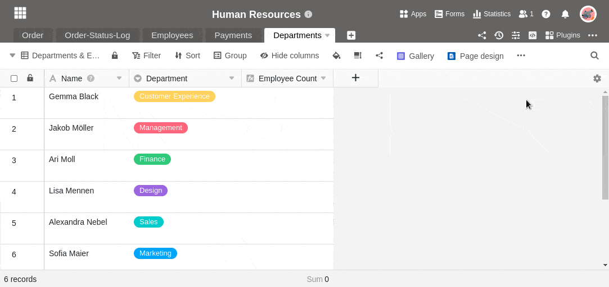
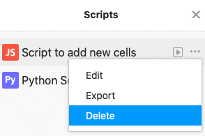

Whether JavaScript or Python script, you can do great things with a script in SeaTable. While JavaScript is executed in the user's browser and is meant for rather simple file manipulations, Python scripts are executed directly on the SeaTable server and are therefore more powerful and versatile. Just give it a try and create any script inside a Base.

## Creating a script

1. In your Base, click  in the Base header.
2. Click **New Script**.
3. Select one of the **script types** (JavaScript or Python).
4. **Name the** script.
5. Write or copy any script into the **text box**.
6. **Close** the window to let SeaTable save your newly created script.

## Delete a script

1. In your Base, click  in the Base header.
2. Hover the mouse over the **name of** your script.
3. Click on the **three dots** .
4. Click **Delete**.


