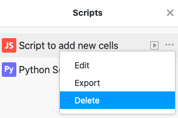

Ya sea JavaScript o Python script, puede hacer grandes cosas con un script en SeaTable. Mientras que JavaScript se ejecuta en el navegador del usuario y está pensado para manipulaciones de archivos bastante sencillas, los scripts de Python se ejecutan directamente en el servidor de SeaTable y, por lo tanto, son más potentes y versátiles. Pruébelo y cree cualquier script dentro de una base.

## Creación de un script

1. En su Base, haga clic en  en la cabecera de la Base.
2. Haga clic en **Nuevo guión**.
3. Seleccione uno de los **tipos de script** (JavaScript o Python).
4. **Nombra el** guión.
5. Escriba o copie cualquier guión en el **campo de texto**.
6. **Cierre** la ventana para que SeaTable guarde su script recién creado.

## Borrar un script

1. En su Base, haga clic en  en la cabecera de la Base.
2. Mueva el ratón sobre el **nombre de** su script.
3. Haga clic en los **tres puntos** .
4. Haga clic en **Eliminar.**


