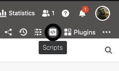

Quer seja JavaScript ou Python script, pode fazer grandes coisas com um script em SeaTable. Enquanto o JavaScript é executado no navegador do utilizador e destina-se a manipulações de ficheiros bastante simples, os scripts Python são executados directamente no servidor SeaTable e são, portanto, mais poderosos e versáteis. Basta experimentar e criar qualquer script dentro de uma base.

## Criar um guião

1. Na sua Base, clique em  no cabeçalho da Base.
2. Clique em **Novo Roteiro**.
3. Seleccione um dos **tipos de guião** (JavaScript ou Python).
4. **Dar um nome ao** guião.
5. Escrever ou copiar qualquer script para o **campo de texto**.
6. **Feche** a janela para que o SeaTable salve o seu script recém-criado.

## Eliminação de um guião

1. Na sua Base, clique em  no cabeçalho da Base.
2. Mova o rato sobre o **nome do** seu guião.
3. Clique nos **três pontos** .
4. Clique em **Eliminar.**


