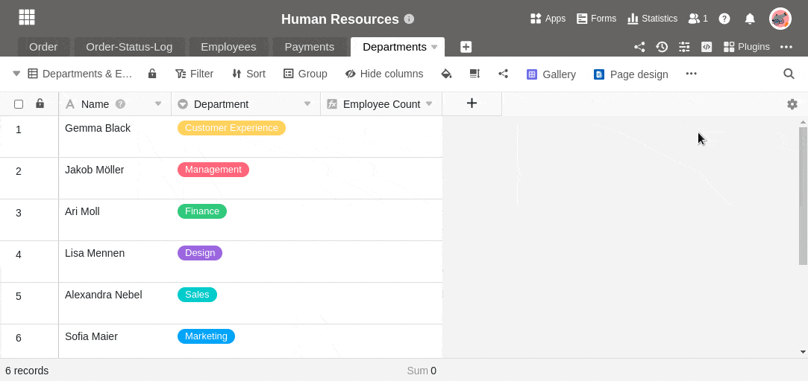

Будь то сценарий JavaScript или Python, с помощью сценария в SeaTable можно делать большие вещи. В то время как JavaScript выполняется в браузере пользователя и предназначен для довольно простых манипуляций с файлами, сценарии Python выполняются непосредственно на сервере SeaTable и поэтому являются более мощными и универсальными. Просто попробуйте и создайте любой скрипт в базе.

## Создание сценария

1. В своей базе нажмите  в заголовке базы.
2. Нажмите кнопку **Новый сценарий**.
3. Выберите один из **типов сценариев** (JavaScript или Python).
4. **Назовите** сценарий.
5. Напишите или скопируйте любой сценарий в **текстовое поле**.
6. **Закройте** окно, чтобы SeaTable сохранил только что созданный сценарий.

## Удаление сценария

1. В своей базе нажмите  в заголовке базы.
2. Наведите курсор мыши на **название** вашего сценария.
3. Нажмите на **три точки** .
4. Нажмите **Удалить**.


