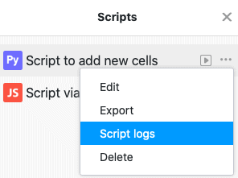
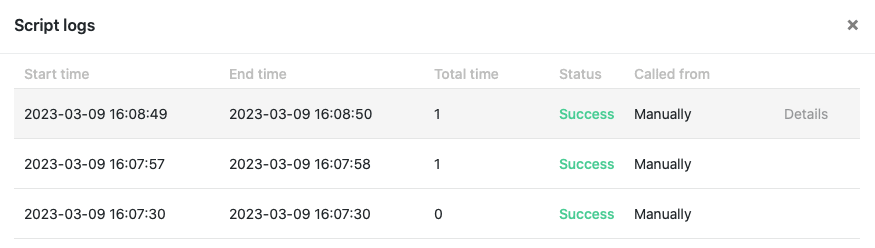

With a script you can do great things in SeaTable. Scripts created in your bases have an execution log where you can find useful information about the runs of the script.



## Open the execution log

1. In your Base, click  in the Base header.
2. Hover the mouse over the **name of** your script.
3. Click on the **three dots** .
4. Click **Script Log** to open the execution log of the selected script.

## Information in the execution log

### The execution log of a script currently contains the following information:

- **Start time** (the exact time when the execution of the script was started).
- **End time** (the exact time when the execution of the script was finished).
- **Total duration** (time needed to execute the script)
- **Status** (indicates whether the script was executed successfully).
- **Invoked by** (indicates how the script was brought to execution - [manually, by automation or by button](https://seatable.io/en/docs/javascript-python/skript-manuell-per-schaltflaeche-oder-automation-ausfuehren/)).

Hover over a run of your script and click **Details** to get more information about the execution of your script.

