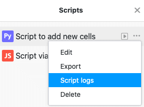

Puede hacer grandes cosas en SeaTable con un script. Los scripts creados en sus bases tienen un registro de ejecución donde puede encontrar información útil sobre las ejecuciones del script.



## Abrir el registro de ejecución

1. En su Base, haga clic en  en la cabecera de la Base.
2. Mueva el ratón sobre el **nombre de** su script.
3. Haga clic en los **tres puntos** .
4. Haga clic en **Registro de scripts** para abrir el registro de ejecución del script seleccionado.

## Información en el registro de ejecución

### El registro de ejecución de un script contiene actualmente la siguiente información:

- **Hora de inicio** (la hora exacta en que se inició la ejecución del script)
- **Hora de finalización** (la hora exacta a la que finalizó la ejecución del script)
- **Duración total** (tiempo necesario para ejecutar el script)
- **Estado** (indica si el script se ha ejecutado correctamente)
- **Invoked by** (indica cómo se ejecutó la secuencia de comandos: [manualmente, mediante automatización o mediante un botón]()

Pase el ratón por encima de una ejecución de su script y haga clic en **Detalles** para obtener más información sobre la ejecución de su script.

