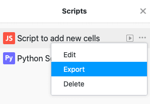

SeaTable ermöglicht es Ihnen, individuelle JavaScript- und Python-Skripte in einer Base auszuführen. Neben der Möglichkeit, Skripte manuell in das Textfeld zu schreiben, haben Sie die Möglichkeit, Skripte in SeaTable zu importieren sowie bestehende Skripte zu exportieren.

## Import eines Skriptes

1. Klicken Sie in Ihrer Base auf  im Base-Header.
2. Klicken Sie auf **Import**.
4. Wählen Sie eine **Skript-Datei vom Typ .js oder .py** von Ihrem Gerät für den Import aus.
5. Das importierte **Skript** wird automatisch in SeaTable gespeichert und zu Ihren bereits bestehenden Skripten hinzugefügt.

## Export eines Skriptes

1. Klicken Sie in Ihrer Base auf  im Base-Header.
2. Fahren Sie mit der Maus über den **Namen** Ihres Skriptes.
3. Klicken Sie auf die **drei Punkte** .
4. Klicken Sie auf **Exportieren**.
5. Das ausgewählte **Skript** wird anschließend heruntergeladen und als Datei auf Ihrem Gerät gespeichert.

