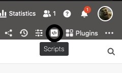
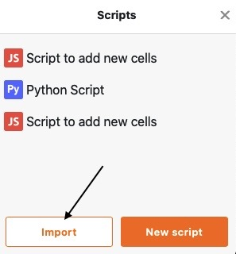
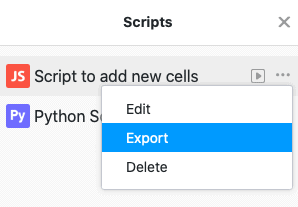

SeaTable permite-lhe executar scripts individuais de JavaScript e Python numa base. Além da possibilidade de escrever scripts manualmente no campo de texto, tem a possibilidade de importar scripts para SeaTable, bem como de exportar scripts existentes.

## Importação de um guião

1. Na sua Base, clique em  no cabeçalho da Base.
2. Clique em **Importar**.

4. Seleccione um **ficheiro .js ou .py script** do seu dispositivo para importação.
5. O **script** importado é automaticamente guardado em SeaTable e adicionado aos seus scripts existentes.

## Exportação de um guião

1. Na sua Base, clique em  no cabeçalho da Base.
2. Mova o rato sobre o **nome do** seu guião.
3. Clique nos **três pontos** .
4. Clique em **Exportar**.
5. O **script** seleccionado é então descarregado e guardado como um ficheiro no seu dispositivo.

