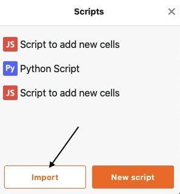

SeaTable позволяет вам выполнять отдельные сценарии JavaScript и Python в базе. Помимо возможности писать сценарии вручную в текстовом поле, у вас есть возможность импортировать сценарии в SeaTable, а также экспортировать существующие сценарии.

## Импорт сценария

1. В своей базе нажмите  в заголовке базы.
2. Нажмите кнопку **Импорт**.

4. Выберите **файл сценария .js или .py** с вашего устройства для импорта.
5. Импортированный **сценарий** автоматически сохраняется в SeaTable и добавляется к существующим сценариям.

## Экспорт сценария

1. В своей базе нажмите  в заголовке базы.
2. Наведите курсор мыши на **название** вашего сценария.
3. Нажмите на **три точки** .
4. Нажмите на кнопку **Экспорт**.
5. Затем выбранный **сценарий** загружается и сохраняется в виде файла на вашем устройстве.

