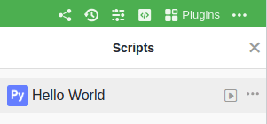
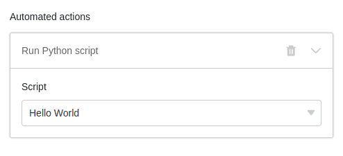

You can do great things in SeaTable with a script. However, nothing happens by saving alone: in fact, the execution of the script must be started either **manually**, **by button** or **by automation**.

In this article, we will introduce you to these three different possibilities. The article assumes that you have already [created]() in your Base, which in our example does nothing but output _Hello World_.

## Run script manually

1. In your Base, click  in the Base header.
2. Hover the mouse over the **name of** your script.
3. Start the script with the **play icon** .



## Execute script via a button

1. Create a column of the type [Button]().
2. Decide which **label** and **color** you want the button to have.
3. Use the **Run Script** action.
4. Select your **script** and save.

From now on, every time you click the button, your script will be executed. Within the script, you can access the values of row by calling _context.current_row_. Of course, you can also access all other rows via the [rows-ID or by using a loop.]()

## Run script via automation



You can use an automation to run a Python script. JavaScript is not available to you at this point because JavaScript is executed in the user's browser, which is not available in an automation.

1. In the Base header, click  and then click **Automation Rules**.
2. Click **Add rule** and create a new **automation**. You can get more detailed information on how to do this [here]().
3. Use the **Run Python Script** automation action.
4. Select your **script** and save the automation with **Submit**.

