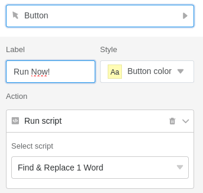

Puede hacer grandes cosas en SeaTable con un script. Sin embargo, nada ocurre sólo por guardar: la ejecución del script debe iniciarse **manualmente**, **por botón** o **por automatización**.

En este artículo te presentaremos estas tres posibilidades diferentes. El artículo asume que ya has [creado]() en tu base, que en nuestro ejemplo no hace nada más que dar como salida _hola mundo_.

## Ejecutar el script manualmente

1. En su Base, haga clic en  en la cabecera de la Base.
2. Mueva el ratón sobre el **nombre de** su script.
3. Inicie el guión con el **icono de reproducción** .



## Ejecutar script mediante un botón

1. Crear una columna de tipo [Button]().
2. Decide qué **etiqueta** y qué **color** debe tener el botón.
3. Utilice la acción **Ejecutar script**.
4. Seleccione su **guión** y guárdelo.

A partir de ahora, cada vez que pulse el botón, se ejecutará su script. Dentro del script, puede acceder a los valores de la fila llamando a _context.current_row_. Por supuesto, también puede acceder a todas las demás filas a través del [ID de]() fila o con la ayuda de un bucle.

## Ejecutar script mediante automatización



Con la ayuda de una automatización, puede ejecutar un script de Python. JavaScript no está disponible en este punto porque JavaScript se ejecuta en el navegador del usuario, que no está disponible en una automatización.

1. En la cabecera Base, haga clic en  y, a continuación, en **Reglas de automatización**.
2. Haga clic en **Añadir Regla** y cree una nueva **automatización**. Puede encontrar información más detallada sobre cómo hacerlo [aquí]().
3. Utilice la acción de automatización **Ejecutar script Python**.
4. Seleccione su **script** y guarde la automatización con **Enviar**.

