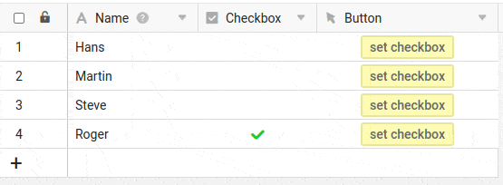

Stellen Sie sich vor, Sie möchten in einer Base immer genau in einer Zeile eine Checkbox aktivieren. Wenn diese Checkbox aktiviert wird, sollen alle anderen eventuell gefüllten Checkboxen deaktiviert werden. Diesen Vorgang können Sie z. B. über eine Schaltfläche ganz einfach mit einem Skript erledigen.



## Das Ergebnis

Mit jedem Klick auf die Schaltfläche wird in dieser Zeile die Checkbox aktiviert und alle anderen werden deaktiviert.



## Das komplette Skript

```js
// vars
const viewName = 'Default View';
const targetCheckboxColumnName = 'Checkbox';

// code - don't change careless!
const currentRow = base.context.currentRow;
const table = base.getActiveTable();
const view = base.getViewByName(table, viewName);
const rows = base.getRows(table, view);
const selectedRows = [],
    updatedRows = [];

// set check
base.modifyRow(table, currentRow, { [targetCheckboxColumnName]: true });

// remove all other checks
let pos = 0;
rows.forEach((row) => {
    if (pos >= 0 && row[targetCheckboxColumnName]) {
        selectedRows.push(row);
        updatedRows.push({ [targetCheckboxColumnName]: false });
    }
    pos++;
});
base.modifyRows(table, selectedRows, updatedRows);
```
