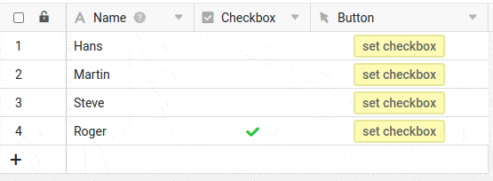

Imaginez que vous souhaitiez activer une case à cocher dans une base sur une seule ligne. Lorsque cette case à cocher est activée, toutes les autres cases à cocher éventuellement remplies doivent être désactivées. Vous pouvez effectuer cette opération très simplement à l'aide d'un script, par exemple via un bouton.



## Le résultat

Chaque fois que tu cliques sur le bouton, la case à cocher de cette ligne est activée et toutes les autres sont désactivées.



## Le script complet

```js
// vars
const viewName = 'Default View';
const targetCheckboxColumnName = 'Checkbox';

// code - don't change careless!
const currentRow = base.context.currentRow;
const table = base.getActiveTable();
const view = base.getViewByName(table, viewName);
const rows = base.getRows(table, view);
const selectedRows = [],
    updatedRows = [];

// set check
base.modifyRow(table, currentRow, { [targetCheckboxColumnName]: true });

// remove all other checks
let pos = 0;
rows.forEach((row) => {
    if (pos >= 0 && row[targetCheckboxColumnName]) {
        selectedRows.push(row);
        updatedRows.push({ [targetCheckboxColumnName]: false });
    }
    pos++;
});
base.modifyRows(table, selectedRows, updatedRows);
```
