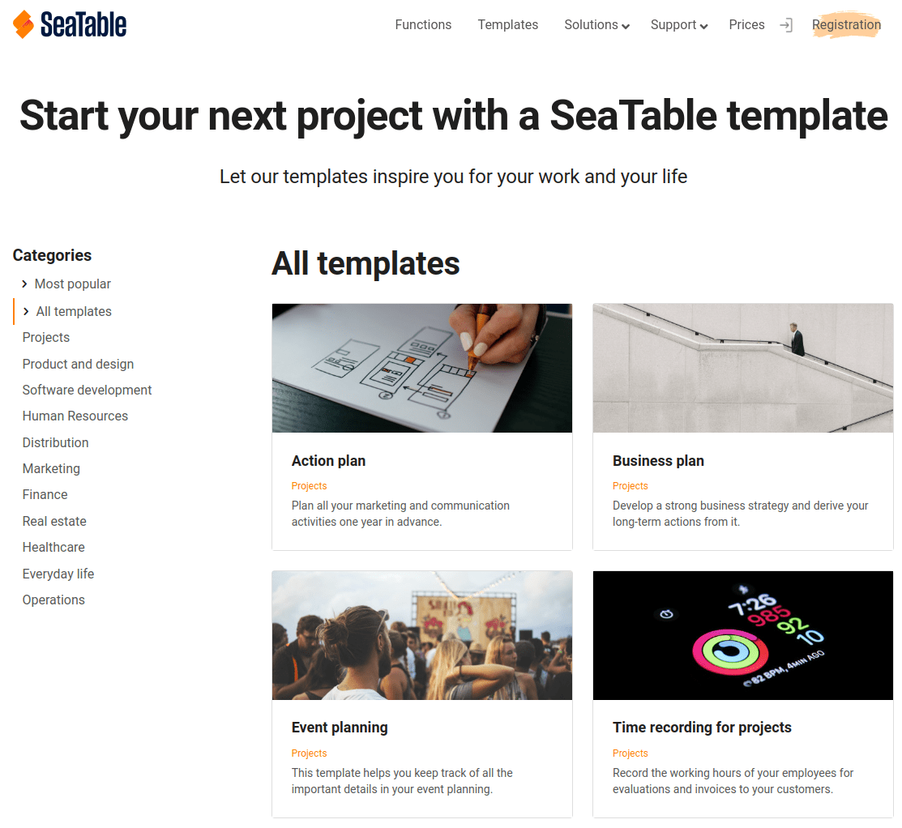

Si todavía está indeciso sobre el diseño de su base o simplemente busca nueva inspiración, en SeaTable tiene la opción de crear rápida y fácilmente una base a partir de una plantilla.

## Creación de una base mediante una plantilla

1. Cambie a la página de **inicio** de SeaTable.
2. Dependiendo de si desea crear una base en _Mis bases_ o en uno de sus grupos, haga clic en **Añadir una base o carpeta** en el área correspondiente.
3. En el menú desplegable que se abre, haga clic en **Crear base a partir de plantilla**.
4. Seleccione **cualquier plantilla para** su base y haga clic en **Usar plantilla**.
5. La **base** aparece ahora en el área correspondiente de la página de inicio y puede empezar a trabajar inmediatamente en ella.

## Utilizar una plantilla directamente desde el sitio web de SeaTable

En el [sitio web de SeaTable, en la sección Plantillas](https://seatable.io/es/vorlagen/), encontrará una variedad de plantillas para diferentes casos de uso. Cada plantilla le ofrece una vista previa de la estructura de tablas del sitio web para que pueda hacerse una idea rápida de cómo está estructurada la base.

Si le gusta una plantilla y quiere probarla, puede hacer clic en **Usar plantilla** para copiar la plantilla directamente en su SeaTable Cloud en el área **Mis bases**. También saltas directamente a la base y puedes empezar a explorarla inmediatamente.

Si no ha iniciado la sesión, primero llegará a la página de inicio de sesión. Una vez que se haya autentificado, debe hacer clic de nuevo en el enlace **Usar plantilla**.
