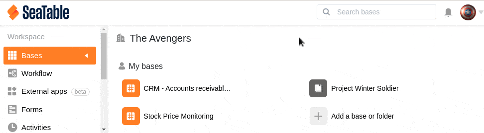

Чтобы вам было легче отслеживать свои базы в SeaTable, у вас есть возможность назначить цвет и значок базе при ее создании. Впоследствии вы можете изменить как цвет, так и значок. Здесь вы можете узнать, как настроить внешний вид базы:

1. Переключитесь на **начальную** страницу SeaTable.
2. Наведите курсор мыши на **базу**, внешний вид которой вы хотите **настроить**.
3. Для редактирования нажмите на **символ карандаша** в правой области, который находится прямо слева от **трех точек**.
4. Выберите новый **цвет** и **значок** для соответствующей базы.
5. **Подтвердите** изменения, нажав **клавишу Enter**.
   
