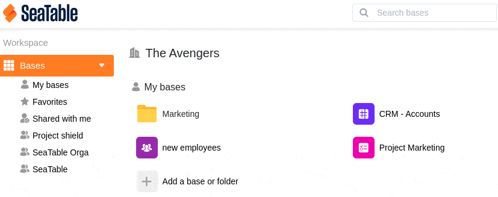

Um Ihren Arbeitsbereich nach Belieben zu gestalten, haben Sie die Möglichkeit, die Reihenfolge zu ändern, in der Ihre Gruppen auf der Startseite von SeaTable erscheinen. Hier erfahren Sie, wie Sie die Reihenfolge der Gruppen ändern können:

## Die Reihenfolge der Gruppen ändern:

1. Wechseln Sie zur **Startseite** von SeaTable.
2. Klicken Sie auf der linken Seite auf das **Dreieck-Symbol** rechts neben dem Arbeitsbereich **Bases**.
3. Im sich nun öffnenden Drop-Down-Menü sehen Sie nun sowohl Ihre **Gruppen** als auch die Arbeitsbereiche **Meine Bases**, **Favoriten** und **Für mich freigegeben**.
4. Um die Reihenfolge der Gruppen zu ändern, ziehen Sie einfach eine beliebige Gruppe per **Drag-and-Drop** an die gewünschte Position. Nutzen Sie hierfür die **sechs Punkte**, die sich **rechts neben jeder Gruppe** befinden.


