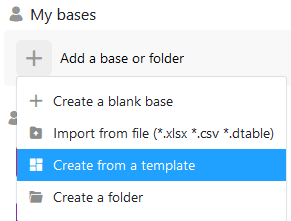
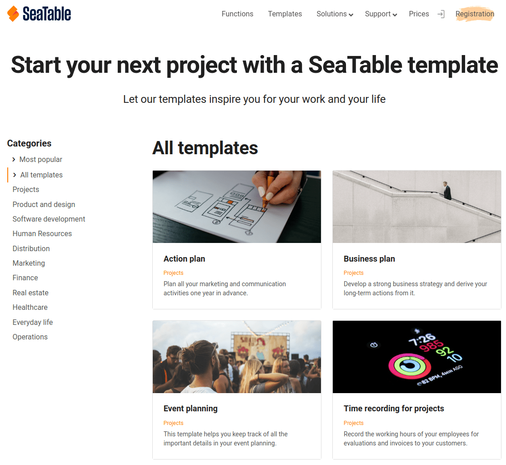

Falls Sie mit der Gestaltung Ihrer Base noch unschlüssig sind oder einfach nur nach neuen Inspirationen suchen, haben Sie in SeaTable die Möglichkeit, schnell und einfach eine Base aus einer Vorlage zu erstellen.

## Anlegen einer Base mithilfe einer Vorlage

1. Wechseln Sie zur **Startseite** von SeaTable.
2. Je nachdem, ob Sie unter _Meine Bases_ oder in einer Ihrer Gruppen eine Base anlegen möchten, klicken Sie im entsprechenden Bereich auf **Eine Base oder Ordner hinzufügen**.
3. Klicken Sie im sich öffnenden Drop-Down-Menü auf **Base von Vorlage erstellen**.
4. Wählen Sie eine **beliebige Vorlage** für Ihre Base aus und klicken Sie auf **Vorlage benutzen**.
5. Die **Base** erscheint nun im entsprechenden Bereich auf der Startseite und Sie können sofort mit der Arbeit in dieser Base loslegen.

## Verwenden einer Vorlage direkt über die Webseite von SeaTable

Auf der [Webseite von SeaTable im Bereich Vorlagen]() finden Sie eine Vielzahl von Vorlagen für die verschiedensten Anwendungsfälle. Jede Vorlage bietet Ihnen auf der Webseite eine Voransicht der Tabellenstruktur, sodass Sie schnell ein Gefühl dafür bekommen, wie die Base aufgebaut ist.

Wenn Ihnen eine Vorlage gefällt und Sie diese ausprobieren wollen, dann können Sie mit einem Klick auf **Vorlage benutzen** die Vorlage direkt in Ihre SeaTable Cloud in den Bereich **Meine Bases** kopieren. Außerdem springen Sie direkt in die Base und können unmittelbar mit der Erkundung der Base beginnen.

Wenn Sie aktuell nicht eingeloggt sind, landen Sie zuerst auf der Login-Seite. Sobald Sie sich authentifiziert haben, müssen Sie erneut auf den Link **Vorlage benutzen** klicken.
