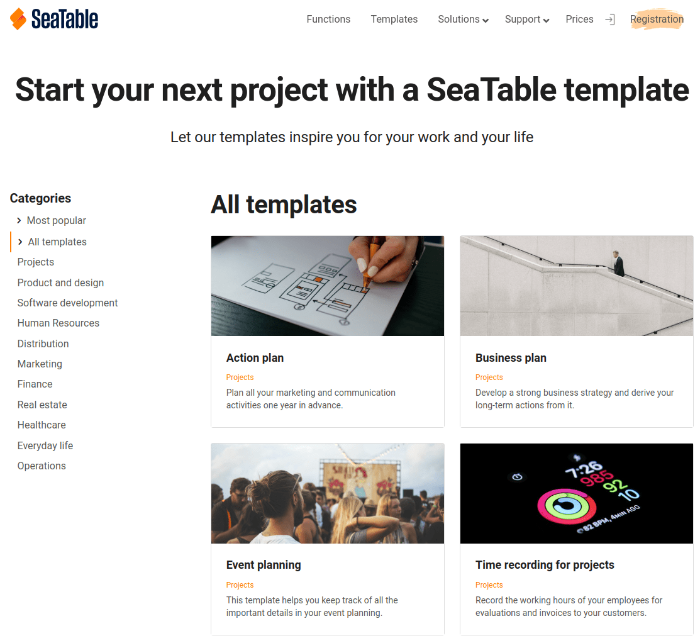

Se ainda estiver indeciso sobre o design da sua base ou se estiver simplesmente à procura de nova inspiração, tem a opção no SeaTable de criar rápida e facilmente uma base a partir de um modelo.

## Criação de uma base utilizando um modelo

1. Mudar para a página **inicial** da SeaTable.
2. Dependendo de querer criar uma base em _Minhas Bases_ ou num dos seus grupos, clique em **Adicionar uma base ou pasta** na área correspondente.
3. No menu pendente que se abre, clicar em **Create Base from Template (Criar Base a partir do Modelo**).
4. Seleccione **qualquer modelo para a** sua base e clique em **Use Template**.
5. A **base** aparece agora na área correspondente na página inicial e pode começar a trabalhar imediatamente nesta base.

## Usando um modelo directamente do website SeaTable

No [website SeaTable na secção Templates](https://seatable.io/pt/vorlagen/) encontrará uma variedade de modelos para diferentes casos de utilização. Cada modelo oferece-lhe uma pré-visualização da estrutura da tabela no website, para que possa rapidamente ter uma ideia de como a base está estruturada.

Se gostar de um modelo e quiser experimentá-lo, pode clicar em **Use Template** para copiar o modelo directamente para a sua SeaTable Cloud na área **My Bases**. Também salta directamente para a base e pode começar imediatamente a explorá-la.

Se não estiver actualmente logado, irá primeiro aterrar na página de login. Depois de se autenticar, deve clicar novamente no link **Utilizar modelo**.
