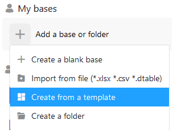

Если вы еще не определились с дизайном базы или просто ищете новое вдохновение, в SeaTable у вас есть возможность быстро и легко создать базу на основе шаблона.

## Создание базы с помощью шаблона

1. Переключитесь на **начальную** страницу SeaTable.
2. В зависимости от того, хотите ли вы создать базу в разделе _Мои базы_ или в одной из ваших групп, нажмите **Добавить базу или папку** в соответствующей области.
3. В открывшемся выпадающем меню выберите **Создать базу из шаблона**.
4. Выберите **любой шаблон для** вашей базы и нажмите кнопку **Использовать шаблон**.
5. Теперь **база** появляется в соответствующей области на стартовой странице, и вы можете немедленно начать работу в этой базе.

## Использование шаблона непосредственно с сайта SeaTable

На [сайте SeaTable в разделе "Шаблоны"]() вы найдете множество шаблонов для различных случаев использования. Каждый шаблон предлагает предварительный просмотр структуры таблиц на сайте, чтобы вы могли быстро получить представление о том, как структурирована база.

Если вам понравился шаблон и вы хотите его опробовать, вы можете нажать на **Use Template**, чтобы скопировать шаблон прямо в ваше SeaTable Cloud в области **My Bases**. Вы также прыгаете прямо на базу и можете сразу же начать ее исследовать.

Если вы не вошли в систему, то сначала вы попадете на страницу входа в систему. После аутентификации необходимо снова нажать на ссылку **Использовать шаблон**.
