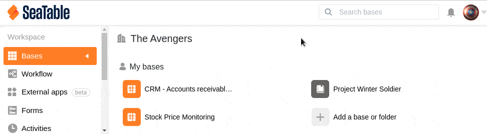

To make it easier for you to keep track of your bases in SeaTable, you have the option to assign a color and an icon to a base when you create it. Both color and icon can be changed afterwards. Here you can learn how to customize the appearance of a Base:

1. Switch to the SeaTable **home** page.
2. Move the mouse over the **Base** whose appearance you want to **customize**.
3. To edit, click the **pencil icon** in the right pane, which is just to the left of the **three dots**.
4. Select a new **color** and **icon** for the corresponding base.
5. **Confirm** the changes by pressing the **Enter key**.
   
