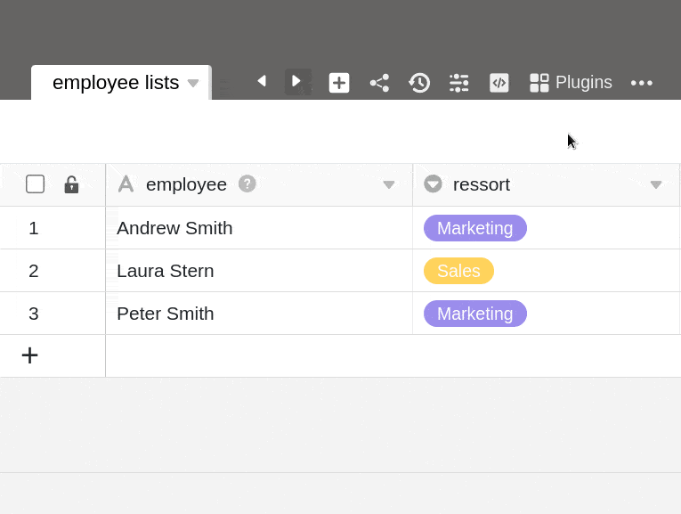



With SeaTable you bring more color into your daily work - especially compared to drab databases and dull spreadsheets. With [Enterprise subscription](https://seatable.io/en/preise/) it is even possible that you insert **your own custom colors** via hexadecimal code into the color palette, which you encounter at various places within a base.

For example, you can colorize [selection options](https://seatable.io/en/docs/auswahlspalten/hinzufuegen-von-optionen-zu-einer-einfachauswahl-spalte/), [buttons](https://seatable.io/en/docs/andere-spalten/die-schaltflaeche/), and [cells](https://seatable.io/en/docs/ansichtsoptionen/einfaerben-von-zellen/) to match your corporate design, or let your creativity run wild with the color scheme.



## Add your own colors

1. Click on the **three dots** in the Base header.
2. Go to **Settings**.
3. Select the **color settings**.
4. Under the _Custom Colors_ tab, click the **\[+\] icon**.
5. Select any color from the color **picker** as the **background** color _or_ add a custom color to the color palette by **hexadecimal code**.
6. Select black or white as the **font color**.
7. Confirm with **Submit** and then click **Submit** again to save the newly added color.

## Edit colors

Colors added to a base can be **adjusted** at any time using the same method.

1. Click on the **three dots** in the Base header.
2. Go to **Settings**.
3. Select the **color settings**.
4. Under the _Custom Colors_ tab, click **Edit**.
5. Click on the **color** you want to edit.
6. Select a **new background and font color**.
7. Confirm the changes by clicking **Submit** and then click **Submit** again to save the changes.

## Delete colors

You can **delete** colors added to a base at any time using the same method.

1. Click on the **three dots** in the Base header.
2. Go to **Settings**.
3. Select the **color settings**.
4. Under the _Custom Colors_ tab, click **Edit**.
5. Click the **x icon** on the color you want to delete.
6. Confirm the deletion with **Submit**.



Currently in SeaTable Cloud it is **not** possible to define your own color for a base (base header, [base icon on the home](). Here you can only choose from the default **12 colors**.


