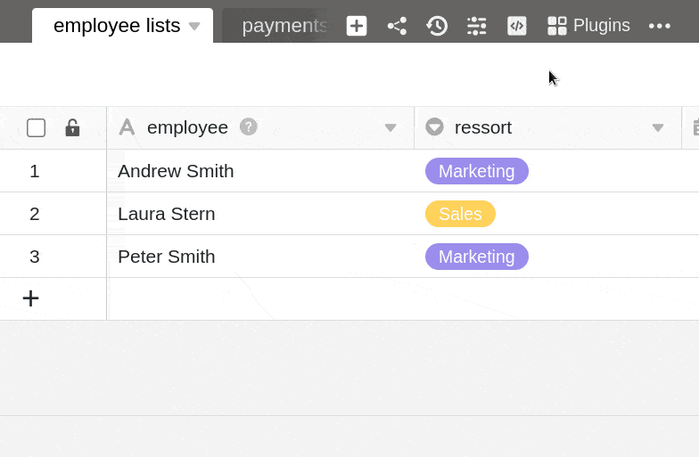
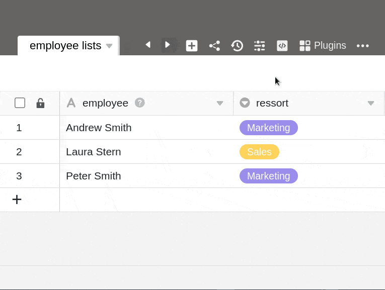
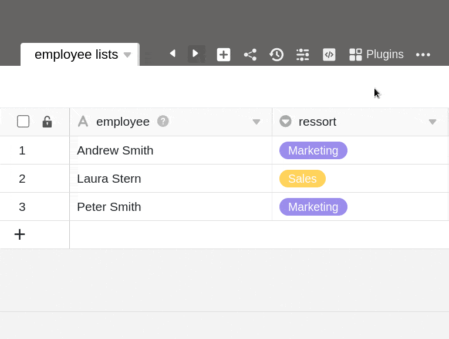



Con SeaTable aportará más color a su trabajo diario, especialmente en comparación con las bases de datos monótonas y las aburridas hojas de cálculo. Con la [suscripción Enterprise](https://seatable.io/es/preise/), incluso es posible añadir tus **propios colores personalizados** mediante código hexadecimal a la paleta de colores que encuentras en varios lugares dentro de una base.

Por ejemplo, puede colorear [las opciones de selección](), los [botones](https://seatable.io/es/docs/andere-spalten/die-schaltflaeche/) y las [celdas](https://seatable.io/es/docs/ansichtsoptionen/einfaerben-von-zellen/) para que coincidan con su diseño corporativo o dar rienda suelta a su creatividad en el diseño de colores.



## Añada sus propios colores

1. Haga clic en los **tres puntos** de la cabecera de la base.
2. Ve a **Ajustes**.
3. Selecciona los **ajustes de color**.
4. Haga clic en el **símbolo \[+**\] de la pestaña _Mis colores_.
5. Seleccione cualquier color del **selector de** color como color de **fondo** _o_ añada un color personalizado mediante **código hexadecimal** a la paleta de colores.
6. Seleccione blanco o negro como **color de fuente**.
7. Confirme con **Enviar** y vuelva a hacer clic en **Enviar** para guardar el color recién añadido.

## Editar colores

Los colores añadidos a una base pueden **ajustarse** en cualquier momento utilizando el mismo método.

1. Haga clic en los **tres puntos** de la cabecera de la base.
2. Ve a **Ajustes**.
3. Selecciona los **ajustes de color**.
4. Haga clic en **Editar** en la pestaña _Mis colores_.
5. Haga clic en el **color** que desea editar.
6. Seleccione un **nuevo color de fondo y de fuente**.
7. Confirme los cambios con **Enviar** y vuelva a hacer clic en **Enviar** para guardar los cambios.

## Borrar colores

Puede **eliminar** los colores añadidos a una base en cualquier momento utilizando el mismo método.

1. Haga clic en los **tres puntos** de la cabecera de la base.
2. Ve a **Ajustes**.
3. Selecciona los **ajustes de color**.
4. Haga clic en **Editar** en la pestaña _Mis colores_.
5. Haga clic en el **símbolo x** en el color que desea eliminar.
6. Confirme la eliminación con **Enviar**.



Actualmente, **no** es posible en SeaTable Cloud definir su propio color para una base (encabezado de la base, [icono de la base en la](). Aquí solo puede elegir entre los **12 colores** predefinidos.


