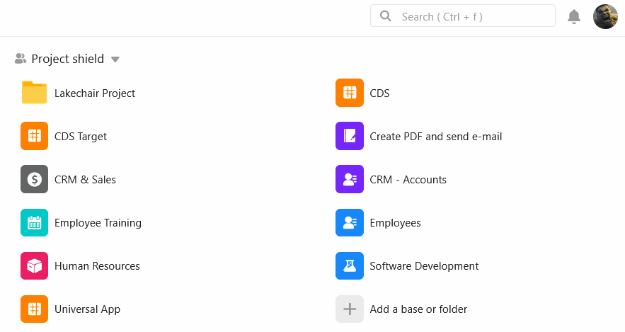

Puede **copiar** bases fácilmente en SeaTable. De este modo, puede mover una de sus bases a otro **grupo** o copiar una base de un grupo al espacio de trabajo **Mis bases**.

## Copiar una base

1. Cambie a la página de **inicio** de SeaTable.
2. Mueva el ratón sobre la **base** que desea copiar.
3. Haga clic en los **tres puntos** y luego en **Copiar**.
4. Seleccione el **grupo** deseado en el que se va a copiar la base.
5. Confirme con **Enviar**.



Tras la copia, la base correspondiente se encuentra tanto en la ubicación **original** como en la de **destino**. Si es necesario, puede [eliminar]() la base en una ubicación.



## Copiar una base vinculada a registros de datos compartidos

Si copia una base que contiene [registros]() de datos compartidos, puede decidir si desea **conservar** la **conexión con estos registros de datos**. Por supuesto, el grupo al que se copia la base debe tener [acceso a]() los registros de datos compartidos.

## Se requieren derechos de administrador

Si el grupo deseado **no** aparece en la selección, puede deberse a que no dispone de **autorización** suficiente. Para copiar bases en un grupo es necesario ser **administrador** o **propietario** del grupo de destino.
