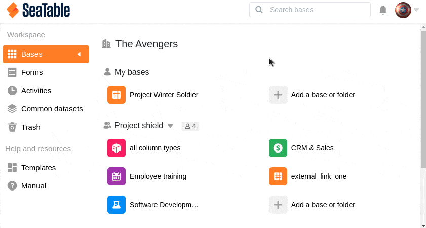

Vous pouvez facilement **copier** des bases dans SeaTable. De cette manière, vous pouvez déplacer une de vos bases vers un autre **groupe** ou copier une base d'un groupe vers l'espace de travail **Mes bases**.

## Copier une base

1. Passez à la **page d'accueil** de SeaTable.
2. Passez la souris sur la **base** que vous souhaitez copier.
3. Cliquez sur les **trois points** et ensuite sur **Copier.**
4. Sélectionnez le **groupe** souhaité dans lequel la base doit être copiée.
5. Confirmez en cliquant sur **Envoyer**.



Après la copie, la base correspondante se trouve à la fois à l'**endroit d'origine** et à l'**endroit de destination**. Si nécessaire, vous pouvez ensuite [supprimer]() la base à un endroit.



## Copier une base liée à des jeux de données communs

Si vous copiez une base dans laquelle [des jeux de données communs]() sont intégrés, vous pouvez décider de **conserver** le **lien avec ces enregistrements**. Le groupe dans lequel vous copiez la base doit bien sûr avoir [accès aux jeux de données communs]().

## Droits d'administrateur requis

Si le groupe souhaité ne s'affiche **pas** dans la sélection, cela peut être dû au fait que vous ne disposez pas d'une **autorisation** suffisante. Pour copier des bases dans un groupe, vous devez être soit **administrateur**, soit **propriétaire** du groupe cible.
