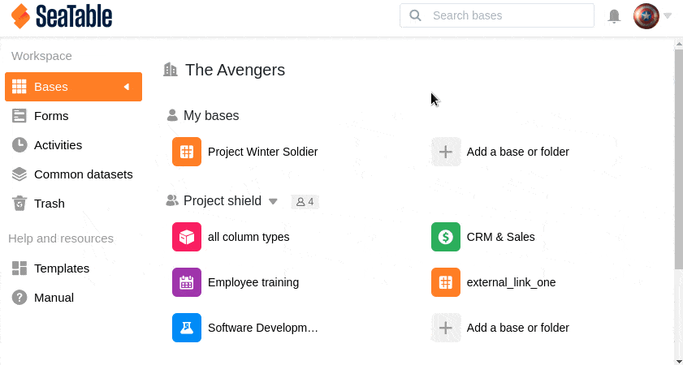
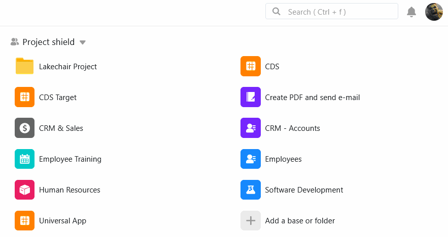

Вы можете легко **копировать** базы в SeaTable. Таким образом, вы можете переместить одну из своих баз в другую **группу** или скопировать базу из группы в рабочую область " **Мои базы"**.

## Копирование базы

1. Переключитесь на **начальную** страницу SeaTable.
2. Наведите курсор на **базу**, которую нужно скопировать.
3. Нажмите на **три точки**, а затем на **Копировать**.
4. Выберите нужную **группу**, в которую будет скопирована база.
5. Подтвердите нажатием кнопки **Отправить**.



После копирования соответствующая база находится как в **исходном местоположении**, так и в **местоположении назначения**. При необходимости базу можно [удалить]() в том или ином месте.



## Копирование базы, связанной с общими записями данных

Если вы копируете базу, содержащую общие [записи]() данных, вы можете решить, **сохранять** ли **связь с этими записями данных**. Группа, в которую вы копируете базу, конечно же, должна иметь [доступ к]() общим записям данных.

## Требуются права администратора

Если нужная группа **не** отображается в выборе, это может быть связано с тем, что вы не обладаете достаточными **полномочиями**. Для копирования баз в группу необходимо, чтобы вы были **администратором** или **владельцем** целевой группы.
