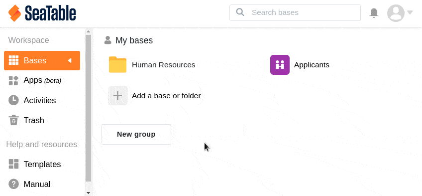
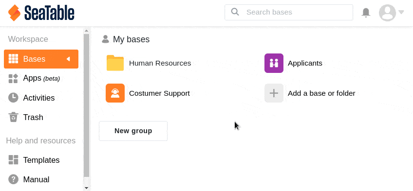

In SeaTable haben Sie die Möglichkeit, im Arbeitsbereich **Meine Bases** eine neue leere Base zu erstellen. Auch in einer Ihrer **Gruppen** können Sie eine neue Base anlegen, wenn Sie Eigentümer oder Administrator dieser Gruppe sind. Als einfaches Gruppenmitglied können Sie allerdings keine neue Base in einer Gruppe anlegen.

## Eine neue leere Base über die Startseite erstellen

1. Beginnen Sie auf der **Startseite** von SeaTable.
2. Klicken Sie im entsprechenden Arbeitsbereich (Meine Bases oder eine Ihrer Gruppen) auf **Eine Base oder Ordner hinzufügen**.
3. Wählen Sie dann **Leere Base erstellen**.
4. Geben Sie der Base einen **Namen**, weisen Sie ihr eine Farbe und ein Icon zu und speichern Sie den Vorgang durch Drücken der **Enter-Taste**.
5. Die neu erstellte Base erscheint nun im entsprechenden **Arbeitsbereich** auf der Startseite.

Sie können Ihre neue Base nun nach Belieben mit **Inhalten** füllen und Prozesse in ihr aufbauen.

## Eine Base über einen Ordner erstellen

Zusätzlich besteht die Möglichkeit, eine neue Base über einen Ordner zu erstellen.

1. Beginnen Sie auf der **Startseite** von SeaTable.
2. Klicken Sie im entsprechenden Arbeitsbereich (Meine Bases oder eine Ihrer Gruppen) auf einen **Ordner**.
3. Im sich öffnenden Fenster klicken Sie oben rechts auf **Neu**.
4. Wählen Sie aus, ob Sie eine **leere Base erstellen**, eine [Base importieren](#base_importieren) oder eine [Base aus einer Vorlage]() erstellen möchten.
5. Geben Sie der Base einen **Namen**, weisen Sie ihr eine Farbe und ein Icon zu und speichern Sie den Vorgang durch Drücken der **Enter-Taste**.
6. Die neu erstellte Base erscheint nun in der Ordner-Übersicht und ist im entsprechenden **Ordner** auf der Startseite gespeichert.

Sie können Ihre neue Base nun nach Belieben mit **Inhalten** füllen und Prozesse in ihr aufbauen.

## Einschränkungen beim Namen

Sie können praktisch jeden beliebigen Namen für Ihre Base verwenden. Der Name darf **Buchstaben**, **Zahlen** und **Sonderzeichen** enthalten, aber **maximal 248 Zeichen** lang sein. Aktuell sind jedoch die beiden Zeichen **Slash** und **Backslash** nicht erlaubt. Auch **Emojis** sind nicht zulässig.
