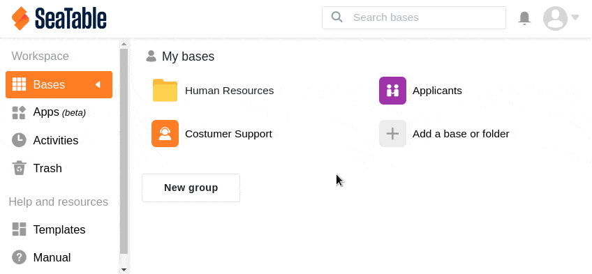

En SeaTable tiene la opción de crear una nueva base vacía en el espacio de trabajo **Mis Bases**. También puede crear una nueva base en uno de sus **grupos** si es el propietario o administrador de ese grupo. Sin embargo, como simple miembro de un grupo, no puede crear una nueva base en un grupo.

## Crear una nueva base vacía a través de la página de inicio

1. Comience en la **página de inicio** de SeaTable.
2. En el espacio de trabajo correspondiente (Mis bases o uno de sus grupos), haga clic en **Añadir una base o carpeta**.
3. A continuación, seleccione **Crear base vacía**.
4. Dale un **nombre** a la base, asígnale un color y un icono y guarda el proceso pulsando la **tecla Intro**.
5. La base recién creada aparece ahora en el **espacio de trabajo** correspondiente de la página de inicio.

Ahora puede llenar su nueva base de **contenido** y construir procesos en ella como desee.

## Crear una base a través de una carpeta

Además, es posible crear una nueva base a través de una carpeta.

1. Comience en la **página de inicio** de SeaTable.
2. Haga clic en una **carpeta** del espacio de trabajo correspondiente (Mis bases o uno de sus grupos).
3. En la ventana que se abre, haga clic en **Nuevo** en la esquina superior derecha.
4. Seleccione si desea **crear** una **base vacía**, [importar](#base_importieren) una base o crear una [base a partir de una plantilla]().
5. Dale un **nombre** a la base, asígnale un color y un icono y guarda el proceso pulsando la **tecla Intro**.
6. La base recién creada aparece ahora en la vista general de carpetas y se guarda en la **carpeta** correspondiente de la página de inicio.

Ahora puede llenar su nueva base de **contenido** y construir procesos en ella como desee.

## Restricciones del nombre

Puede utilizar prácticamente cualquier nombre para su base. El nombre puede contener **letras**, **números** y **caracteres especiales**, pero no puede superar los **248 caracteres**. Sin embargo, actualmente no están permitidos los dos caracteres **barra** y **barra invertida**. **Los emojis** tampoco están permitidos.
