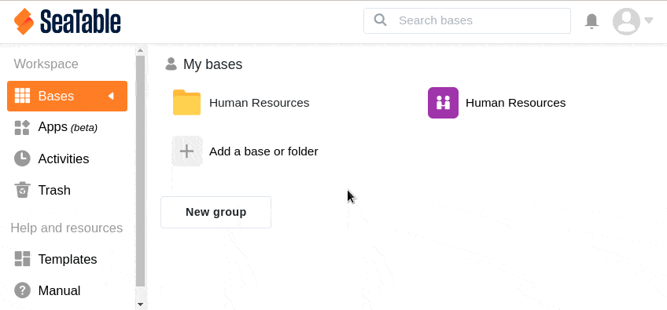

Para uma melhor visão geral das suas bases, tem a opção de criar novas **pastas** em **As minhas bases**, bem como em **Partilhadas comigo** e nos **grupos** individuais. Pode utilizar as pastas, por exemplo, para armazenar diferentes bases para um tópico. Saiba como criar uma pasta no SeaTable aqui:

## Criar uma pasta através da página inicial

1. Mudar para a página **inicial** da SeaTable.
2. Dependendo se pretende criar uma pasta em **As minhas bases**, **Partilhada comigo** ou num **grupo** específico, clique em **Adicionar uma base ou pasta** na área correspondente.
3. Clique em **Criar pasta** no menu pendente que se abre.
4. Dê à pasta um **nome à** sua escolha e confirme-o clicando no sinal verde.
5. A **pasta** aparece agora na secção correspondente e pode preenchê-la com as [bases]() que desejar.
   

## Criar uma pasta na síntese de pastas

Para além do método descrito na primeira secção, também pode criar uma pasta através da **vista geral das pastas**. Esta abre-se automaticamente numa nova janela quando se clica numa pasta existente na página **inicial**.

1. Mudar para a página **inicial** da SeaTable.
2. Clique numa **pasta** já existente.
3. Clique em **New Folder (Nova pasta**) na janela que se abre.
4. Dê à pasta um **nome** à sua escolha e confirme-o clicando no **visto verde** ou premindo a **tecla Enter**.
5. A pasta aparece agora na **vista geral das pastas** abertas e na **secção** correspondente da página inicial e pode ser preenchida com as bases que desejar.
   
