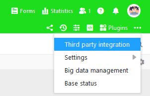
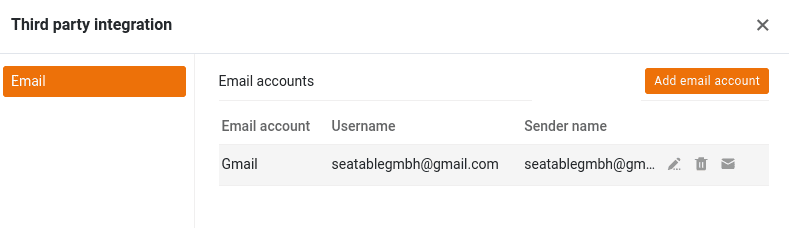
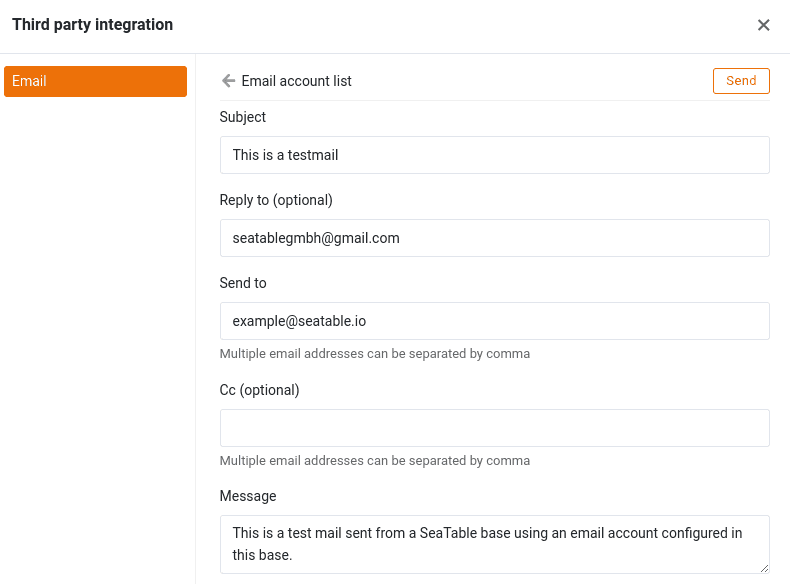

One of the countless options available to you in SeaTable is **sending emails** from your bases. This feature of SeaTable will save you a considerable amount of time if you always want to send certain emails at a certain point in a process - for example, a payment reminder once the deadline for paying an invoice has passed.

This article explains the steps required to add an email account to a base and how you can then send emails from your base.

## Set up an email account in your Base

1. Open the advanced base options by clicking on the **three-dot icon** .
2. Select the option **Integration of third-party providers**.
3. Click on **Add e-mail account**.
4. Select the appropriate **service provider**.
5. Enter the data required for the respective service provider.

{{< warning  headline="Not all e-mail accounts are the same"  text="**Google and Microsoft** no longer allow email applications to log in with a user name and password. Gmail allows authentication using an app password or via OAuth 2.0. With the Microsoft products Microsoft 365 and Outlook, only authentication via OAuth 2.0 is possible. If you want to use one of these two providers, select it as your service provider. If your email provider supports authentication via user name and password, select **Generic email provider**." />}}

To make account setup easier, we offer step-by-step instructions for the most popular email providers:

- [Gmail](https://seatable.io/en/docs/integrationen-innerhalb-von-seatable/gmail-fuer-den-versand-von-e-mails-per-smtp-einrichten/)
- [GMX and WEB.DE](https://seatable.io/en/docs/integrationen-innerhalb-von-seatable/gmx-oder-web-de-fuer-den-versand-von-e-mails-per-smtp-einrichten/)
- [Outlook and Microsoft 365](https://seatable.io/en/docs/integrationen-innerhalb-von-seatable/microsoft-365-fuer-den-versand-von-e-mails-per-smtp-einrichten/)

## Testing the email configuration

After you have successfully added an email account to your Base, the created account will be displayed in the advanced Base options under **third-party integration**. Here you can send a **test email** to selected recipients with just a few clicks.

To do this, click the **envelope icon** to the right of your set up email account.

Then define the **subject**, **recipient**, and **content of** the test email. For example, you can send yourself an email to your own email address.

If a connection to the e-mail server has been successfully established, a brief success message appears and an e-mail from the configured e-mail account should arrive in the specified recipient mailbox.

If everything worked as described, you have successfully set up your email account in SeaTable and can start sending emails via [automation](https://seatable.io/en/docs/beispiel-automationen/e-mail-versand-per-automation/) or [button](https://seatable.io/en/docs/andere-spalten/eine-e-mail-per-schaltflaeche-verschicken/).

## Sending e-mail from a base

After adding your email account in a Base, you will have **two** different options for sending emails:

- [E-mail dispatch via automation](https://seatable.io/en/docs/beispiel-automationen/e-mail-versand-per-automation/)
- [E-mail dispatch by button](https://seatable.io/en/docs/andere-spalten/eine-e-mail-per-schaltflaeche-verschicken/)

In both ways, you define a standardized e-mail whose **text** remains the **same for all recipients and records**. Therefore, this function is not suitable for e-mails whose content varies greatly from case to case. However, you can **quote** **entries** from different columns, for example insert the respective name in the salutation or the order number in the subject, in order to **personalize** the respective **e-mail to** some extent and enrich it with the data from the row concerned.

## Frequently asked questions



Are the e-mail access data (especially the password) visible to others, e.g. when I share a base?|||

**No**, the secret email access data is **not compromised** by sharing a base. For email accounts that log in to the email server using a user name and password, the password is no longer displayed in plain text after setup. For email accounts set up with OAuth 2.0 authentication, neither the ID nor the key are displayed.

---

Are e-mail accounts copied when a base is copied?|||

**No**, the email accounts set up for a base are **not copied**. If you copy a base to the _My Bases_ area or [to a group](https://seatable.io/en/docs/arbeiten-mit-bases/eine-base-in-eine-gruppe-kopieren/), you must **set up** the email accounts **again** in the new base.

---

Are e-mail accounts exported when exporting a base?|||

**No**, the e-mail accounts set up in a base are **not exported to the [DTABLE file](https://seatable.io/en/docs/import-von-daten/dtable-dateiformat/)**.


