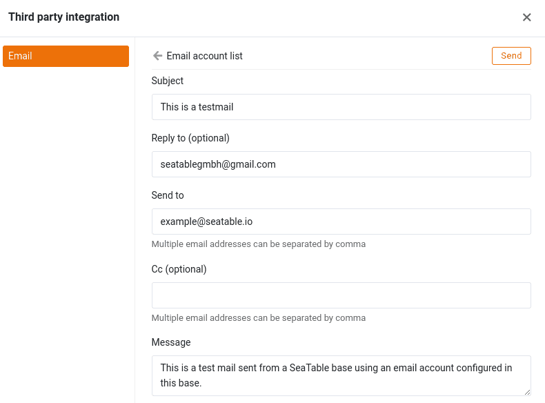

L'une des innombrables possibilités offertes par SeaTable est l'**envoi d'e-mails** depuis vos bases. Cette fonction de SeaTable vous permet de gagner un temps considérable si vous souhaitez toujours envoyer des e-mails spécifiques à un moment donné d'un processus - par exemple, un rappel de paiement dès que la date limite de règlement d'une facture est dépassée.

Cet article explique les étapes nécessaires pour ajouter un compte e-mail à une base et comment envoyer des e-mails depuis votre base.

## Configurer un compte de messagerie dans votre base

1. Ouvrez les options avancées de la base en cliquant sur l'**icône à trois points** .
2. Sélectionnez l'option **Intégration de tiers**.
3. Cliquez sur **Ajouter un compte de messagerie**.
4. Sélectionnez le **fournisseur de services** approprié.
5. Saisissez les données demandées pour chaque fournisseur de services.

{{< warning  headline="Tous les comptes de messagerie ne se valent pas"  text="**Google et Microsoft** n'autorisent plus les applications de messagerie à se connecter avec un nom d'utilisateur et un mot de passe. Gmail permet l'authentification au moyen du mot de passe de l'application ou via OAuth 2.0. Pour les produits Microsoft, Microsoft 365 et Outlook, seule l'authentification via OAuth 2.0 est possible. Si vous souhaitez utiliser l'un de ces deux fournisseurs, sélectionnez-le comme fournisseur de services. Si votre fournisseur de messagerie prend en charge l'authentification par nom d'utilisateur et mot de passe, sélectionnez **Fournisseur de messagerie générique**." />}}

Pour faciliter la configuration du compte, nous proposons des instructions étape par étape pour les fournisseurs de messagerie les plus populaires :

- [Gmail](https://seatable.io/fr/docs/integrationen-innerhalb-von-seatable/gmail-fuer-den-versand-von-e-mails-per-smtp-einrichten/)
- [GMX et WEB.DE](https://seatable.io/fr/docs/integrationen-innerhalb-von-seatable/gmx-oder-web-de-fuer-den-versand-von-e-mails-per-smtp-einrichten/)
- [Outlook et Microsoft 365](https://seatable.io/fr/docs/integrationen-innerhalb-von-seatable/microsoft-365-fuer-den-versand-von-e-mails-per-smtp-einrichten/)

## Tester la configuration du courrier électronique

Après avoir ajouté avec succès un compte e-mail à votre base, le compte créé s'affiche dans les options avancées de la base sous **Intégration de tiers**. Ici, vous pouvez envoyer un **e-mail test** aux destinataires sélectionnés en quelques clics seulement.

Pour ce faire, cliquez sur l'**icône en forme d'enveloppe** à droite de votre compte de messagerie configuré.

Définissez ensuite l **'objet**, le **destinataire** et **le contenu** de l'e-mail test. Vous pouvez par exemple vous envoyer un e-mail à votre propre adresse e-mail.

Si la connexion au serveur de messagerie a été établie avec succès, un bref message de succès s'affiche et un e-mail devrait arriver dans la boîte aux lettres du destinataire indiqué depuis le compte de messagerie configuré.

Si tout s'est déroulé comme décrit, vous avez configuré avec succès votre compte e-mail dans SeaTable et vous pouvez commencer à envoyer des e-mails par [automatisation](https://seatable.io/fr/docs/beispiel-automationen/e-mail-versand-per-automation/) ou [par bouton](https://seatable.io/fr/docs/andere-spalten/eine-e-mail-per-schaltflaeche-verschicken/).

## Envoi d'e-mails à partir d'une base

Après avoir ajouté votre compte e-mail dans une base, vous disposez de **deux** possibilités différentes pour l'envoi d'e-mails :

- [Envoi d'e-mails par automatisation](https://seatable.io/fr/docs/beispiel-automationen/e-mail-versand-per-automation/)
- [Envoi d'e-mails par bouton](https://seatable.io/fr/docs/andere-spalten/eine-e-mail-per-schaltflaeche-verschicken/)

Les deux méthodes permettent de définir un e-mail standardisé dont le **texte** reste **identique pour tous les destinataires et tous les enregistrements**. Cette fonction n'est donc pas adaptée aux e-mails dont le contenu varie fortement d'un cas à l'autre. Vous pouvez toutefois **citer** **des entrées** de différentes colonnes, par exemple en insérant le nom correspondant dans la formule de politesse ou le numéro de commande dans l'objet, afin de **personnaliser** un peu plus l'**e-mail** en question et de l'enrichir avec les données de la ligne concernée.

## Questions fréquentes



Les données d'accès à la messagerie (en particulier le mot de passe) sont-elles visibles pour les autres, par exemple lorsque je partage une base ?|||

**Non**, les données d'accès secrètes à la messagerie ne sont **pas menacées** par le partage d'une base. Pour les comptes de messagerie qui se connectent au serveur de messagerie au moyen d'un nom d'utilisateur et d'un mot de passe, le mot de passe n'est plus affiché en clair après la configuration. Pour les comptes de messagerie configurés avec l'authentification OAuth 2.0, ni l'ID ni la clé ne sont affichées.

---

Les comptes de messagerie sont-ils copiés lors de la copie d'une base ?|||

**Non**, les comptes de messagerie configurés dans une base ne sont **pas copiés**. Si vous copiez une base dans le domaine _Mes bases_ ou [dans un groupe](), vous devez **reconfigurer** les comptes de messagerie dans la nouvelle base.

---

Les comptes de messagerie sont-ils également exportés lors de l'exportation d'une base ?|||

**Non**, les comptes de messagerie configurés dans une base ne sont **pas exportés dans le [fichier DTABLE](https://seatable.io/fr/docs/import-von-daten/dtable-dateiformat/)**.


