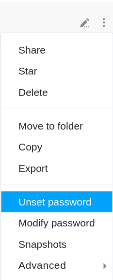

Para proteger tus bases de accesos externos no deseados, puedes establecer una **contraseña** cualquiera para cada base, que deberá ser introducida correctamente por todos los usuarios, incluido tú, para poder abrir y posteriormente editar la base correspondiente.

Esto tiene sentido especialmente para las bases de **grupo** que no deben ser accesibles a todos los miembros del grupo. De todos modos, sólo tú tienes acceso a las bases del área **Mis bases**. Una contraseña puede ser útil si [compartes una base con un grupo]().

## Establecer una contraseña para una base



1. Cambie a la página de **inicio** de SeaTable.
2. Sitúe el ratón sobre la **base** para la que desea establecer una contraseña.
3. Haz clic en los **tres puntos** que aparecen a la derecha.
4. Haga clic en **Establecer contraseña**.
5. Establezca una **contraseña** para la base.
6. Introduzca la contraseña por **segunda vez** y confirme con **Enviar**.

## Establecer contraseña

Tras hacer clic en **Establecer contraseña**, se abre una ventana en la que puede establecer una **contraseña con cualquier número de letras, números o caracteres especiales**. Introduzca la contraseña en el **campo** previsto y **repítala** en el segundo campo. Si es necesario, utilice las dos opciones  y  situadas a la derecha del primer campo de entrada para **visualizar** la contraseña que ha introducido o para generar una **contraseña aleatoria**.

## Base protegida por contraseña

Las bases protegidas con contraseña aparecen siempre marcadas con un **candado** en la página de inicio.

Para acceder a una base protegida por contraseña, **cada** usuario debe introducir primero la contraseña correctamente. Al intentar acceder a la base, se abre automáticamente una **ventana** en la que hay que introducir la contraseña de **la base**.

En cuanto haya introducido correctamente la contraseña de una base, tendrá **acceso a** la misma. El acceso se **mantiene** aunque **abandones** la base o **vuelvas a cargar** la página. Sin embargo, si **cierra** completamente la página, se le pedirá que introduzca **de nuevo** la contraseña de la base la próxima vez que intente acceder a ella.

## Cambiar contraseña



Para cambiar la contraseña base, sólo tiene que seguir la ruta para establecer una contraseña y hacer clic en **Cambiar** contraseña.

Tras hacer clic en **Cambiar contraseña**, se abre una nueva **ventana** en la que puede asignar una nueva contraseña para la base correspondiente. Para cambiar la contraseña de la base, debe introducir también la **contraseña actual**. En cuanto confirme el cambio de contraseña con **Enviar**, se activará la nueva contraseña de base establecida.

## Cancelar contraseña

Para cancelar una contraseña existente para una base, siga también la ruta descrita anteriormente y haga clic en **Cancelar contraseña**.

A continuación se abre una ventana en la que debe introducir la contraseña **base actual**. Confirme la anulación de la contraseña con **Enviar**.

Una vez que haya anulado correctamente la contraseña de la base, ésta podrá abrirse de nuevo **sin necesidad de introducir la contraseña**. Por lo tanto, la base **ya no** aparece marcada con un **símbolo de candado** en la página de inicio.

