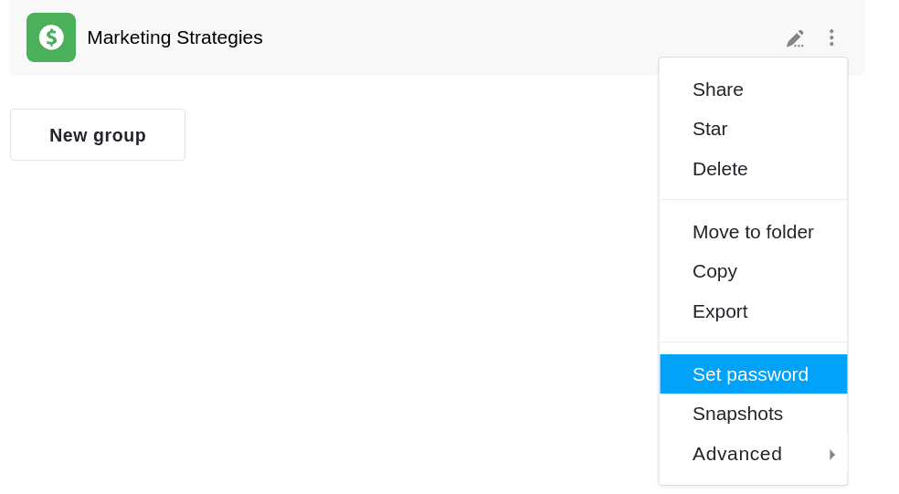

Pour protéger vos bases d'un accès étranger indésirable, vous pouvez définir pour chaque base un **mot de passe** de votre choix, qui doit être saisi correctement par chaque utilisateur, y compris vous-même, pour pouvoir ouvrir la base correspondante et la modifier ensuite.

Cela est particulièrement utile pour les **bases de groupe** auxquelles tous les membres du groupe ne doivent pas avoir accès. Vous êtes de toute façon le seul à avoir accès aux bases de la section **Mes bases**. Là, un mot de passe peut être utile si vous [partagez une base avec un groupe]().

## Définir un mot de passe pour une base



1. Passez à la **page d'accueil** de SeaTable.
2. Passez la souris sur la **base** pour laquelle vous souhaitez définir un mot de passe.
3. Cliquez sur les **trois points** qui apparaissent à droite.
4. Cliquez sur **Définir le mot de passe**.
5. Définissez un **mot de passe** pour la base.
6. Saisissez le mot de passe **une deuxième fois** et confirmez en cliquant sur **Envoyer**.

## Définir un mot de passe

Après avoir cliqué sur **Définir le mot de passe**, une fenêtre s'ouvre dans laquelle vous pouvez définir un **mot de passe avec autant de lettres, chiffres ou caractères spéciaux que** vous le souhaitez. Saisissez le mot de passe dans le **champ** prévu à cet effet et **répétez-le** dans le deuxième champ. Si nécessaire, utilisez les deux options  et  à droite du premier champ de saisie pour afficher le **mot de passe** saisi ou générer un **mot de passe aléatoire**.

## Base protégée par mot de passe

Les bases protégées par un mot de passe sont toujours signalées par une **icône de cadenas** sur la page d'accueil.

Pour avoir accès à une base protégée par un mot de passe, **chaque** utilisateur doit d'abord saisir correctement le mot de passe. Pour cela, une **fenêtre** s'ouvre automatiquement lors de la tentative d'accès à la base, dans laquelle le **mot de passe de la base** doit être saisi.

Dès que vous avez saisi correctement le mot de passe d'une base, vous avez **accès** à cette base. L'accès est **maintenu** même si vous **quittez** la base ou si vous **rechargez** la page. Toutefois, si vous **fermez** complètement la page, il vous sera demandé de saisir à **nouveau** le mot de passe de la base lors de votre prochaine tentative d'accès à la base.

## Modifier le mot de passe



Pour modifier le mot de passe de la base, il suffit de suivre la procédure de définition d'un mot de passe et de cliquer sur **Modifier le mot de passe**.

Après avoir cliqué sur **Modifier le mot de passe**, une nouvelle **fenêtre** s'ouvre, dans laquelle vous pouvez attribuer un nouveau mot de passe à la base correspondante. Pour modifier le mot de passe de la base, il faut également saisir le **mot de passe actuel**. Dès que vous confirmez la modification du mot de passe en cliquant sur **Envoyer**, le nouveau mot de passe de la base est actif.

## Annuler le mot de passe

Pour annuler un mot de passe existant pour une base, suivez également la procédure décrite ci-dessus et cliquez sur **Annuler le mot de passe**.

Une fenêtre s'ouvre ensuite, dans laquelle vous devez saisir le **mot de passe actuel de la base**. Confirmez l'annulation du mot de passe en cliquant sur **Envoyer**.

Après avoir annulé avec succès le mot de passe de la base, il est à nouveau possible d'ouvrir la base **sans saisir de mot de passe**. C'est pourquoi la base n'est **plus** marquée par un **symbole de cadenas** sur la page d'accueil.

