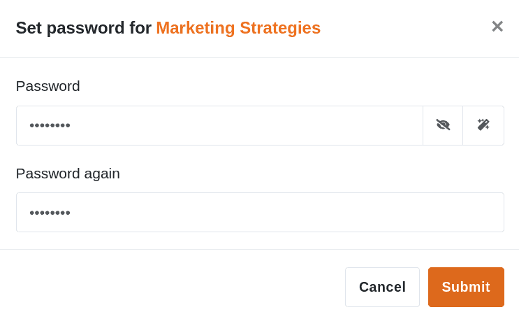
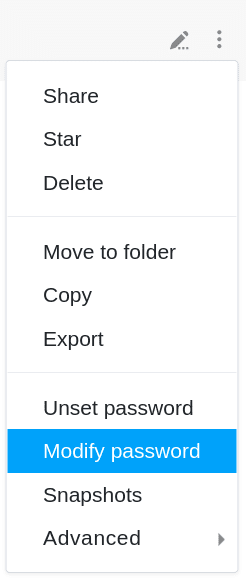

Para proteger as suas bases contra acessos externos indesejados, pode definir qualquer **palavra-passe** para cada base, que deve ser introduzida correctamente por cada utilizador, incluindo o utilizador, a fim de abrir e subsequentemente editar a base correspondente.

Isto faz sentido especialmente para **bases de grupo** que não devem ser acessíveis a todos os membros do grupo. Só tem acesso a bases na área **Minhas Bases** de qualquer forma. Uma palavra-passe pode ser útil lá se [partilhar uma base com um grupo](https://seatable.io/pt/docs/freigaben/eine-base-an-eine-gruppe-freigeben/).

## Definir uma palavra-passe para uma base



1. Mudar para a página **inicial** da SeaTable.
2. Mova o rato sobre a **base** para a qual pretende definir uma palavra-passe.
3. Clique nos **três pontos** que aparecem do lado direito.
4. Clique em **Set Password**.
5. Definir uma **palavra-passe** para a base.
6. Introduzir a palavra-chave **uma segunda vez** e confirmar com **Submeter**.

## Definir palavra-passe

Depois de clicar em **Definir senha**, abre-se uma janela na qual pode definir uma **senha com qualquer número de letras, números ou caracteres especiais**. Introduza a palavra-passe no **campo** fornecido e **repita-a** no segundo campo. Se necessário, utilize as duas opções  e  à direita do primeiro campo de entrada para **exibir** a palavra-passe que introduziu ou para gerar uma **palavra-passe aleatória**.

## Base protegida por palavra-passe

As bases que são protegidas com uma palavra-passe são sempre marcadas com um **símbolo de cadeado** na página inicial.

Para ter acesso a uma base protegida por palavra-passe, **cada** utilizador deve primeiro introduzir a palavra-passe correctamente. Ao tentar aceder à base, abre-se automaticamente uma **janela** na qual a **palavra-passe de base** deve ser introduzida.

Assim que tiver introduzido correctamente a palavra-chave para uma base, terá **acesso à** base. O acesso é **mantido** mesmo que **deixe** a base ou **recarregue** a página. Contudo, se **fechar** completamente a página, ser-lhe-á pedido que introduza **novamente** a palavra-passe da base na próxima vez que tentar aceder à base.

## Alterar palavra-passe



Para alterar a palavra-passe base, basta seguir o caminho para definir uma palavra-passe e clicar em **Change** Password.

Depois de ter clicado em **Alterar senha**, abre-se uma nova **janela** na qual pode atribuir uma nova senha para a base correspondente. Para alterar a palavra-passe de base, é também necessário introduzir a **palavra-passe actual**. Assim que confirmar a alteração da palavra-passe com **Submit**, a palavra-passe de base recentemente definida fica activa.

## Cancelar palavra-passe

Para cancelar uma senha existente para uma base, siga também o caminho descrito acima e clique em **Cancelar senha**.

Abre-se então uma janela na qual se deve introduzir a **palavra-passe base actual**. Confirmar o cancelamento da palavra-passe com **Submeter**.

Depois de ter cancelado com sucesso a palavra-passe de base, a base pode ser aberta novamente **sem introduzir uma palavra-passe**. Por conseguinte, a base **já não** está marcada com um **símbolo de bloqueio** na página inicial.

