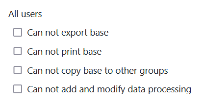

Nas definições de segurança da sua base, pode efectuar, em qualquer altura, definições que afectam a segurança da sua base e a protecção dos dados nela contidos. As definições de segurança aplicam-se especificamente a uma base completa e podem diferir de base para base, consoante as definições efectuadas.



## Editar as definições de segurança de uma base

1. Abra a **base** cujas definições de segurança pretende editar.
2. Clique nos **três pontos** no cabeçalho da base.
3. Aceda a **Definições** e depois a **Definições de segurança**.
4. Na nova janela, defina as definições de segurança para **Todos os utilizadores** e **Utilizadores partilhados**.
5. De seguida, **feche** a janela. As definições efectuadas serão **guardadas** automaticamente.

## Definições de segurança: Todos os utilizadores

A primeira parte das definições de segurança diz respeito às autorizações de **todos os utilizadores** que têm acesso à base correspondente. Nesta secção, pode efetuar as seguintes configurações:

### Impedir a exportação de uma base

Ao ativar esta definição, pode **impedir que** outros utilizadores possam [exportar](#base_exportieren) a sua base.

Se esta definição estiver **activada**, a base em questão deixa de poder ser exportada por **qualquer pessoa** até que a definição seja novamente desactivada por um proprietário ou administrador. Se, mesmo assim, um utilizador tentar exportar a base em questão através da página inicial, a exportação é **impedida** e aparece a seguinte **mensagem de erro**:

### Impedir a impressão de uma base

Ao activar esta definição, pode **impedir que** outros utilizadores possam [imprimir](https://seatable.io/pt/docs/grundlagen-von-ansichten/das-drucken-einer-ansicht/) as várias visualizações de tabela da sua Base.

Se esta definição estiver **activada**, as várias vistas de tabela da base afectada deixam de poder ser impressas por **qualquer pessoa** até que a definição seja novamente desactivada por um proprietário ou administrador. A opção correspondente para impressão nas opções de visualização é apresentada a **cinzento para** todos os utilizadores e já **não** pode ser clicada. Além disso, uma **nota** indica que os utilizadores **não** têm permissão para imprimir as vistas de tabela.

### Impedir a cópia de uma base para outro grupo

Ao activar esta definição, pode **impedir que** outros utilizadores [copiem]().

Se esta definição estiver **activada**, a base em questão não pode ser copiada por **ninguém** para outro grupo ou para a área _As minhas bases_ até que a definição seja novamente desactivada por um proprietário ou administrador. Se, mesmo assim, um utilizador tentar copiar a base correspondente através da página inicial, o processo de cópia é **impedido** e aparece a seguinte **mensagem de erro**:

### Impedir a criação e alteração de operações de tratamento de dados

Ao ativar esta definição, é possível **impedir que** outros utilizadores criem, editem ou eliminem [operações de processamento de dados]().

Se esta definição estiver **activada**, os ícones correspondentes para adicionar, editar ou eliminar operações de processamento de dados ficam **ocultos** até que a definição seja novamente desactivada por um proprietário ou administrador. No entanto, todos os utilizadores podem continuar a executar as [operações de processamento]() de dados existentes.

## Definições de segurança: Utilizadores partilhados

A segunda parte das definições de segurança refere-se às permissões dos **utilizadores** a quem a [base](https://seatable.io/pt/docs/freigaben/anlegen-einer-benutzerfreigabe/) correspondente é [libertada](https://seatable.io/pt/docs/freigaben/anlegen-einer-benutzerfreigabe/). Nesta parte, pode fazer as **mesmas** definições que já estão disponíveis na primeira parte para todos os utilizadores:

### Impedir a exportação de uma base

Ao ativar esta definição, pode **impedir que** os utilizadores a quem a [base](#base_exportieren) a base.

### Impedir a impressão de uma base

Ao activar esta definição, pode **impedir que** os utilizadores a quem a [base](https://seatable.io/pt/docs/freigaben/anlegen-einer-benutzerfreigabe/) correspondente [é libertada](https://seatable.io/pt/docs/freigaben/anlegen-einer-benutzerfreigabe/) possam [imprimir](https://seatable.io/pt/docs/grundlagen-von-ansichten/das-drucken-einer-ansicht/) as várias vistas de tabela da base.

### Impedir a cópia de uma base para outro grupo

Ao activar esta definição, pode **impedir que** os utilizadores a quem a [base]() para outro grupo ou para a área _As minhas bases_.

### Impedir a criação e alteração de operações de tratamento de dados

Ao ativar esta opção, é possível **impedir que** os utilizadores a quem a [base]() dados. No entanto, eles ainda podem [executar]() as [operações]() de processamento de dados existentes.
